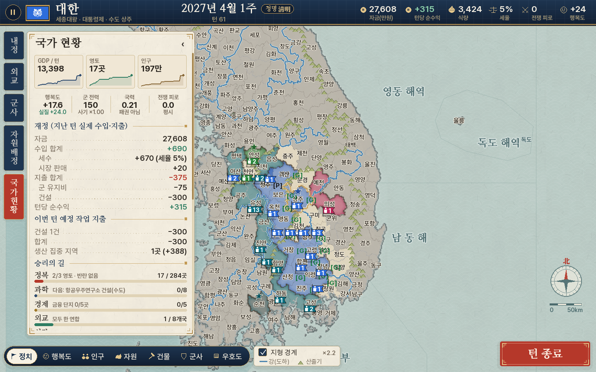

# 한반도의 문명

한반도 시군구 426곳(남한 227, 북한 196, 남북 병합 3)을 한 칸씩 타일로 쓰는 1주 단위 턴제 전략게임입니다.
`docs/기획서.md`(종합 기획서)와 `korciv/data/regions.csv`, `adjacency-overrides.csv`를 바탕으로 Python + pygame으로 만들었습니다.



**현재 버전: v1.0.0 (2026-10-10)** — 시작 화면 오른쪽 아래에도 표시됩니다.

## QA 도구

- `python tools/qa_fuzz.py sim --games 6 --turns 480` — 전원 AI로 끝까지 진행하며 매 턴 불변식(소유자·인구·자원·부대 상태 등) 점검
- `python tools/qa_fuzz.py player --games 10 --turns 300` — 플레이어가 매 턴 무작위로 건설·부대 명령·외교·시장·세율 등을 시도
- `python tools/qa_ui_fuzz.py --frames 12000 [--warm 300]` — 창 없이 모든 화면을 무작위로 클릭·드래그·키 입력(`--warm`은 AI가 먼저 진행한 후반 상태에서)

## 버전과 저장 파일

버전은 `주.부.수` 형식이며 `korciv/version.py`에 있습니다.

| 자리 | 올리는 경우 | 예전 저장 파일 |
|---|---|---|
| 수 (세 번째) | 이어서 플레이할 수 있는 패치: UI 개선, 버그 수정 등 | 그대로 이어하기 가능 |
| 부 (두 번째) | 이어서 플레이할 수 없는 내용 패치: 밸런스, 지역 정보 등 (수는 0으로) | 이어하기에 보이지 않음 |
| 주 (첫 번째) | 게임을 크게 바꾸는 중대한 업데이트 (부·수는 0으로) | 이어하기에 보이지 않음 |

저장 파일에는 항상 버전이 기록되고, [이어하기]에는 지금 게임과 주·부 버전이 같은 파일만 나옵니다. 버전 표기가 없는 예전 파일도 보이지 않습니다(그 슬롯은 빈 칸으로 보이며 새로 저장하면 덮어씁니다).

## 실행

**Windows: `게임실행.bat`을 더블클릭하세요.**
Python이 없으면 자동으로 설치하고(winget), 처음 한 번 필요한 부품(pygame, numpy)을 설치한 뒤 게임을 켭니다. 게임은 콘솔 없는 `pythonw`로 띄우고 검은 창은 바로 닫힙니다(설치가 필요한 첫 실행 때만 진행 상황을 보여 줌). 게임이 갑자기 꺼지면 `%USERPROFILE%\.korciv\error.log`를 보내 주세요.
"Windows의 PC 보호" 창이 뜨면 **추가 정보 → 실행**을 누르세요. macOS·Linux는 `./run.sh`.

직접 실행하려면:

```bash
pip install -r requirements.txt      # pygame, numpy
python -m korciv                      # 게임 시작 (1440×900, 최소 1280×800)
python -m korciv --simulate 200       # 창 없이 AI끼리 200턴 진행 후 결과 출력
python -m pytest                      # 테스트 (pytest 필요)
```

## 조작

| 입력 | 동작 |
| --- | --- |
| 좌클릭 | 구역·해역 선택 (좌측 패널에 [행동]/[부대]/[지역 정보], 내 지역이 아니면 [지역 정보]). 시야 안의 타국 지역은 내 지역과 같은 현황(세수·식량·과밀·특산물·진행 중 슬롯 등), 시야 밖의 타국 지역은 외교 탭의 그 세력 상세 화면, 중립·미탐색 지역은 기본 정보. 이미 선택한 지역을 다시 누르면 패널이 닫힘 |
| 우클릭 | 선택한 부대의 이동·공격·상륙·폭격 대상 지정 (마우스를 올리면 예상 교전 결과 표시). 한 턴에 못 가는 곳을 찍으면 최단 경로로 매 턴 자동 이동(남은 경로는 점선) |
| 휠 / `+` `-` / 더블클릭 | 확대·축소 (0.8~8배, 2배부터 구역 이름, 4배부터 인구 배지) |
| 드래그 / 방향키 | 지도 이동 (방향키는 누르고 있으면 계속 이동) |
| `Enter` | 다음 지역(빈 슬롯이 남았을 때) / 턴 종료 · `Shift+Enter` 바로 턴 종료 |
| `Tab` / `A` | 빈 슬롯 순회 / 빈 슬롯 AI 추천으로 자동 지정 |
| `1`~`7` | 지도 모드: 정치·행복도·인구·자원·건물·군사·우호도 |
| `F1` `F2` `F5` `F9` | 도움말 · 개발자 안개 토글 · 저장(슬롯 3개 중 선택) · 불러오기 |
| `P` / 좌상단 ⏸ | 일시정지 창: 저장 · 저장하고 나가기(저장 후 시작 화면) · 불러오기 · 도움말 · 이벤트 로그 · 반기 랭킹 (선택한 것이 없을 때 `Esc`도 가능) |
| `Ctrl+D` | 다크 모드 |

창 크기를 바꾸거나 최대화하면 화면 전체가 비율을 유지한 채 모니터에 맞게 선명하게 커집니다(글자는 버튼보다 25% 더 크게).
빈 슬롯 지역이 있으면 우하단 버튼이 **[다음 지역]**이 되어 수도부터 영토를 얻은 순서대로 행동 메뉴를 열고, 모두 확인하면 **[턴 종료]**로 바뀝니다.
정치 지도에서 생산·행동이 진행 중인(생산 집중 포함) 내 영토는 더 진한 색으로 표시됩니다.
좌상단 **[국가 현황]** 탭에서 국가 통계·재정(작업별 턴당 지출)·자원·이번 턴 특산물(누르면 생산지 열기)·승리 조건 진행을 보고,
**[내정]** 탭(세율·자원 시장·특산물)의 **지출 우선순위** 목록을 드래그해 자금이 모자랄 때 먼저 비용을 낼 작업을 정할 수 있습니다(기본은 착수 순서).
건설·병력 생산을 하지 않는 지역은 행동 탭에서 **생산 집중**을 켜면 인구 산출(30P)이 15% 늘어납니다(언제든 켜고 끔, AI도 사용).

화면 구성: 상단 국가 상태 바(쪽빛 띠, 날짜 옆 24절기, 수치 hover 시 내역), 가운데 지도, 좌측 끝 세로쓰기 책갈피 탭(위에서부터 내정·외교·군사·자원 배정·국가 현황)과
그 옆 패널(같은 탭을 다시 누르면 접힘, 지역을 누르면 [행동]/[부대]/[지역 정보], 같은 지역을 다시 누르면 닫힘), 좌하단 지도 모드(자원·건물·군사는 누르면 위로 세부 메뉴가 펼쳐져 고른 한 가지만 단계별 색으로 표시: 자원 = 특산물·석탄·석유·자연경관·댐·원전, 건물 = 농장·어장·공장·은행·발전소, 군사 = 방어선·대공포·방공호·사관학교·공항·항구. 전장의 안개로 지금 보이지 않는 지역은 게임 시작 시점 상태로 표시), 우하단 턴 종료 버튼(빈 슬롯이 남았으면 [다음 지역]과 남은 수, 위에 [바로 턴 종료]).

**화면 디자인(v0.48.1)**: 고지도 + 단청 색(한지 패널·쪽빛·주홍·금)과 명조 글꼴(나눔명조, 장식 한자는 Noto Serif KR 부분집합 — `tools/build_serif_font.py`)을 씁니다.
지도는 한지에 번진 수채화처럼 칠하고(정치 지도에서는 국경 안쪽이 세력 색으로 짙어짐), 국경은 먹선, 전쟁 중인 두 나라의 국경에는 옅은 붉은 그림자, 바다에는 청해파 무늬를 깝니다.
강(도하)은 쪽빛 선, 산악 돌파 경계는 대동여지도식 산줄기(∧)로 그립니다. 부대는 군기(육군 제비꼬리·해군 삼각기·공군 날개깃)에 대표 병종 아이콘과 총수, 수도는 별, 이번 턴 전투가 난 지역은 칼 표시입니다.
국가 현황 탭 맨 위에는 GDP·영토·인구의 최근 52턴 추이(이 버전부터 기록, 예전 세이브는 불러온 뒤부터)가 나옵니다.
시작 화면 배경(`korciv/assets/ui/title_bg.jpg`)은 `tools/build_title_bg.py`로 만듭니다.

**국기·초상화**: 시작 화면의 [국기 만들기]에서 배경 무늬 10종(단색·상하/좌우 이등분·세로/가로 삼등분·우상향/우하향 대각선·잉글랜드식 십자·가로세로 4등분·윤곽선)과 문양 23종+없음(도형·종교·동물)을 고르고, 배경 색 1·2와 문양 색 1·2를 색조(스펙트럼)·채도·명도(검은색~흰색) 슬라이더나 그 아래 R·G·B 칸에 0~255 숫자를 직접 입력해(Enter로 슬라이더에 반영, 255를 넘으면 255, 숫자가 아니면 0) 정해 국기를 만듭니다(배경 색 2는 단색이 아닌 배경, 문양 색 2는 태극·도교 태극·꽃 가운데에만 쓰여 그 밖에는 꺼짐). 역사 국기(태극기·인공기·조선 어기·고려 의장기)를 그대로 고를 수도 있습니다. 문양·역사 국기 그림의 출처는 `korciv/assets/CREDITS.md`. AI·반란 세력은 세력 색으로 정해진 기본 국기를 씁니다(`korciv/flags.py`). 지도자 초상화는 `korciv/assets/portraits/<지도자 키>.png`(지도자 키는 3글자, 예: 세종대왕 `sej.png`)(세로 3:4, 권장 600×800)를 넣으면 시작 화면과 외교 탭에 나오고, 없으면 빈 틀이 나옵니다(파일명 목록: `korciv/assets/portraits/README.md`).

**적 국가(v0.41.0)**: 적 세력 수는 1~15(기본 7, v0.41.2)이고, 시작 화면 '적 국가' 칸은 [AI n: 지도자 / 시작 지역]으로 보이고, 누르면 지도자를 고릅니다. 옆의 [모두 무작위 지도자]는 내 지도자를 뺀 지도자 가운데 겹치지 않게, [모두 무작위 지역]은 게임 시작 때와 같은 규칙(수도끼리 육상 6칸 이상, 황해·강원 7칸, 무연륙 섬 제외)으로 정합니다(내 시작 지역을 골랐으면 거기에 맞춰서, 아니면 적 국가끼리만 — 내 수도는 시작할 때 거기에 맞춰 정해짐). [적 국가 지역 선택]을 누르면 지도 화면이 뜨고 왼쪽 아래 'AI 1~n: 지도자' 목록에서 국가를 고른 뒤 지역을 누르면 그곳에 배치됩니다(다른 나라 시작 지역은 고를 수 없음, 직접 고른 곳은 거리 규칙을 따지지 않음). 플레이어 국가의 영토·부대 색은 직접 만든 국기의 배경 색 1이고, 역사 국기를 쓰면 기본 파란색(#2F6FDE)입니다.
**외교 탭**: 세력을 누르면 상단에 국기·국가명, 왼쪽에 초상화, 오른쪽에 수도·관계·우호도, 그 아래 인구·지역 수·GDP·타국과의 관계, 맨 아래 [외교](외교 창 열기)·[선전포고](빨간색, 두 번 눌러 확정) 버튼이 나옵니다.

## 구현한 규칙

기획서 3~11절의 수치는 모두 `korciv/config.py`(밸런스 상수)와 `korciv/leaders.py`(지도자 46명 + 직접 입력·정치체제 7종)에 있습니다.

- **턴·슬롯** — 1턴=1주, 지역마다 슬롯 1개(건설·유닛 생산·편입), 비용은 매 턴 분납, 자금 부족 시 정지, 취소 시 50% 환급. 턴 종료 처리 순서(외교→이동→해전→폭격→지상 공격→점령·편입→건설·생산→자원→세수→인구→행복도→반란)도 기획서 순서 그대로입니다.
- **경제** — Y = 30P + 150F + 150S + 공장 + 600g(B) + 9000K (농장·어장은 단계 비례: 식량 15×단계, 하천 어장 12×단계, 턴당 건설비 200/400/600/800/1000). 식량(자동 구매 옵션)·기근, 시장(구매/판매: 식량 4/3, 전기 20/10, 석유·석탄은 판매만 20·10).
- **인구·행복도·반란** — 성장 공식과 상한, 기근·이주, 세율·생산·해산·피폭·특산물 요인, 0.99 수렴, 반란 확률 p(H)와 수용·진압·독립. 산출·반란·인구·사기 판정은 *실질 행복도*(아래 '전쟁 피로도')로 합니다. 단, 반란 판정에서는 *선포당한 전쟁*에서 쌓인 전쟁 피로를 빼지 않고, 나머지(스스로 선포한 전쟁의) 전쟁 피로는 ×1.2로 반영합니다(무리하게 전쟁을 벌이면 반란이 날 수 있지만, 침략을 당해서는 반란이 나지 않음).
- **군사(v0.4.0 개편)** — 유닛 8종(스텔스폭격기 삭제). 전투력은 '보병 하나가 보정 없이 보병 하나를 공격할 때'를 10으로 둔 공격력/체력입니다(v0.18.0부터 화면에도 이 값 그대로 표시).

  | 유닛 | 비용 | 석유 | 공격력/체력 | 비고 |
  |---|---|---|---|---|
  | 보병 | 250 × 1턴 | – | 10 / 10 | |
  | 포병 | 500 × 2턴 | – | 15 / 10 | 육상 2칸까지 폭격 |
  | 전차 | 750 × 3턴 | 1 | 20 / 50 | |
  | 상륙함 | 500 × 2턴 | 1 | 0 / 20 | 보병×1 + 포병×2 + 전차×4 ≤ 8칸 |
  | 구축함 | 1000 × 3턴 | 1 | 20 / 50 | 해역에서 2칸까지 함포 사격 |
  | 항공모함 | 1500 × 4턴 | 2 | 0 / 100 | 전투기 + 폭격기 ≤ 4대 |
  | 전투기 | 750 × 3턴 | 1 | 30 / 30 | 공격 불가: 돌격 방어(주둔·인접 2칸 공항 지원)와 폭격기 요격만 |
  | 폭격기 | 1000 × 3턴 | 1 | 40 / 20 | 공항·항공모함에서 2칸까지 폭격 |

  돌격의 방어측 피해는 전차 > 보병 > 포병 > 공군 순서로 먼저 채우고, 폭격 피해는 대상 지역의 모든 부대에 무작위로 나눕니다. 폭격기는 폭격 전에 요격을 받습니다: 대상 지역 대공포 단계당 10(최대 50) + 대상·인접 지역 적 전투기 대당 30의 요격력 × 0.5 × 무작위(0.85~1.15)만큼 폭격기가 피해를 입습니다. 유지비는 대략 총비용의 2%입니다.
- **이동·전투 일반** — 자국 영토 2칸·그 밖 1칸 이동, 연륙교, 해군 턴당 1단계(항구→해역, 해역→해역, 해역→상륙·입항 각각 한 턴), 공군 재배치 반경 3칸, 돌격·기습·폭격·대공·공중전·해전·나포·건물 파괴, 방어선(경계별)·방공호·대공포·사관학교·공항·항구, 적 지역은 지키는 병력이 없으면 들어서는 즉시 차지(저항 시작), 중립 지역 편입·점령(지역 가치 기준, 아래).
- **외교** — 우호도 증감표, 우호→통행권·불가침→동맹→연합 4단계, 거래 판정(m = 1.1 − 우호도/250, 수정 제안), 요구·선물(받는 나라 턴당 세수 1턴분마다 우호도 +3, 받는 나라 호전성(지도자 + 정치체제 목표 호전성, 철인통치 5)이 10보다 1 높을 때마다 −0.05·낮을 때마다 +0.05, 소수 둘째 자리 아래 절사, 1회 최대 +25. 자원은 v0.45.0부터 '턴당 n개 × 12턴' 계약: 식량은 내 시장 판매가, 석유·석탄·전기는 받는 나라 공장 산출 증가 × 기준 세율 10%, 특산물은 받는 나라 특산물 값으로 환산), 선전포고(동맹·연합 회원이 선전포고를 당하면 나머지 전원 자동 참전. 연합 회원이 선전포고하려면 연합 전원이 동의해야 하고, 동의하면 연합 전원이 함께 선포. AI 회원은 대상이 패권국·승리 근접국이거나 대상에 대한 우호도 0 이하이고 나라가 흔들리지 않을 때 동의, 플레이어 회원에게는 제안이 옴, v0.25.0)·강화(24턴 불가침), 패권 견제, 국력. 관계는 우호 선언 → 통행권·불가침 → 동맹 → 연합 순으로만 올라갑니다(v0.15.0: 조약과 동맹은 우호 선언 관계가 있어야 제안 가능). 동맹은 조약을 맺은 상대와 우호도 65 이상(패권 견제 시 −20)이면 맺고(v0.14.0부터 공동의 적·견제 대상 조건 없음), AI는 우호도 30 이하로 떨어져야 파기합니다. 동맹 24턴 이상 + 우호도 60 이상이면 연합을 맺습니다(맹주가 패권 세력이어도 가능). 외교승리는 살아 있는 모든 나라가 한 연합에 속하면 달성되므로, 연합 밖의 나라를 모두 멸망시켜도 됩니다.
- **승리** — 정복·과학·경제·외교·시간 종료 5가지(설정에서 켜고 끔). 반기 랭킹은 해마다 1주차·25주차(첫 발표는 2년 차 1주차)에 지역 수·인구·행복도·턴당 GDP(전국 비율)·과학승리 단계를 표로 발표하고, 머리글 열을 누르면 그 항목 순으로 볼 수 있습니다. 국가 현황에 조건별 진행 상황이 나옵니다.
  - *정복*: 전체 지역의 3분의 2 이상을 차지하고, 반란이 일어날 수 있는 지역(반란 판정 행복도 −50 이하)이 하나도 없을 때. 다른 세력을 모두 멸망시켜도 승리.
  - *과학*: ① 수도에 항공우주연구소 → ② 산맥(산악 돌파 경계)과 맞닿은 지역에 천체관측소 → ③ 은행 5단계(금융 단지) 지역에서 예산 편성 → ④ 바다와 맞닿은 지역에 로켓 발사대 → ⑤ 공장 5단계 지역에서 로켓 추진체 → ⑥ 공장 5단계 지역에서 탑승 모듈 → ⑦ 석유 생산 지역에서 발사체 연료. 앞 단계를 마쳐야 다음 단계가 행동 탭 '특수'에 나타납니다. 단계마다 15턴, 턴당 8만부터 단계가 오를 때마다 ×1.1(8만·8.8만·9.7만·10.6만·11.7만·12.9만·14.2만, 합계 약 1,139만, 최소 105턴, v0.37.0). 예산 편성도 같은 증가를 따르고 연구소·관측소·발사대처럼 건물로 남습니다. ⑤~⑦은 전투력이 없는 유닛으로, 자국(연합) 영토 안에서만 움직이고 잃으면 다시 만들 수 있습니다. 세 유닛을 발사대가 있는 내 지역에 모으고 턴을 마치면 승리. 천체관측소가 있는 지역은 폭격이 건물을 맞히면 50% 확률로 관측소가 파괴되고, 그러면 과학 단계에서 빠져 다른 단계를 다 마쳤어도 다시 지을 때까지 발사할 수 없습니다(v0.42.0).
  - *경제(기축통화, v0.15.0)*: 돈만 있으면 언제든 지을 수 있는 대신 외교 관계가 필요합니다. 모두 유닛 없이 건물로 남습니다.

    | 단계 | 조건 | 위치 | 턴당 비용 × 턴 | 효과 |
    |---|---|---|---|---|
    | ① 금융 권역 | 수도를 포함해 서로 맞닿은 한 덩어리의 금융 단지(은행 5단계) 5곳 | — | 일반 은행 건설비 | |
    | ② 증권거래소 | ① | 금융 권역(여러 곳 동시 가능) | 15만 × 10턴 | 그 지역 은행 산출 +10% |
    | ③ 경제특구 | 수도 포함 증권거래소 3곳 | 수도 | 20만 × 15턴 | |
    | ④ 국제금융센터 | 경제특구 + 우호 선언 이상 관계 2개국 | 증권거래소가 있는 지역 | 30만 × 15턴 | 내 선물의 우호도 +10% |
    | ⑤ 기축통화 지정 | 국제금융센터 + 우호 선언 이상 3개국(그중 동맹 1곳 이상) | 수도 | 40만 × 20턴 | 완료하면 승리 |

    합계 2,000만(증권거래소 3곳 450만 + 경제특구 300만 + 국제금융센터 450만 + 기축통화 800만) + 금융 단지 5곳, 최소 60턴(v0.25.0: 과학은 오래 걸리고 조건이 많지만 싸고, 경제는 빠르고 조건이 단순하지만 비싸다).

    점령으로 멈춘 과학·경제 공사(과학 유닛 생산 포함)는 저항·회복 기간(24턴) 안에 원래 주인이 되찾으면 낸 돈과 진행도 그대로 이어서 짓고, 기간이 지나거나 다른 나라에 넘어가면 낸 돈의 50%를 돌려받습니다(v0.25.0).
    점령당한 과학·경제 시설(연구소·관측소·예산 편성·발사대, 증권거래소·경제특구·국제금융센터·기축통화)은 꺼져서 빼앗은 나라도 쓸 수 없습니다. 저항·회복 기간(24턴) 안에 원래 주인이 되찾으면 되살아나고, 못 되찾으면(기간이 지나거나 다른 나라에 넘어가거나 독립) 철거됩니다. 철거되면 그 단계를 다시 지어야 하고(과학은 완료에서 빠짐), 철거 전에는 다시 지을 수 없습니다. 과학 시설이 하나라도 꺼져 있으면 발사할 수 없습니다(v0.31.0).

    '우호 선언 이상'은 우호 선언이 성립한 관계(전쟁·비난·우호도 −30 미만 전까지 유지) 또는 통행권·불가침·동맹·연합이고, 우호도가 높아 저절로 생긴 우호관계는 세지 않습니다. 살아 있는 다른 나라가 조건보다 적으면 남은 나라 모두와의 관계로 충분합니다. 건설 중 조건이 깨지면 중단되고 낸 돈의 50%를 돌려받으며, 다시 지으려면 처음부터 지어야 합니다(v0.16.0). 완공한 건물은 조건이 깨져도 남지만 점령당하면 사라집니다. 다른 나라가 국제금융센터를 완공하거나 기축통화 지정을 시작하면 플레이어에게 알림이 옵니다. 진척도(n/5)는 국가 현황과 반기 랭킹에 나옵니다.
  - *AI의 경제승리 목표*: 경제승리를 노리는 AI는 공장·은행 증축(가치 ×1.3)과 광산·유전·발전소(×1.5)를 늘리고, 다음 경제 단계(경제특구·국제금융센터·기축통화) 비용의 1.1배를 모을 때까지 다른 공사에는 순수입의 절반만 쓰며, 세율 상한이 2%p 높습니다(v0.16.0).
  - *승리 근접국 견제*: 과학·경제 진척이 절반을 넘은 나라는 패권 세력처럼 견제받습니다. 우호 선언·조약 이상 관계가 없는 AI는 그 나라에 대한 우호도가 매 턴 최대 −0.3 줄고, 선전포고 문턱이 최대 +15 쉬워지며, 전쟁 대상 점수가 조금 오릅니다(특정 지역을 노리지는 않음).
  - *외교*: 살아 있는 모든 나라가 하나의 연합에 속하면 연합 전원이 함께 승리.
  - 랜드마크(건물·승리)는 없앴습니다. 시간 종료 승리는 정해진 턴(기본 480턴 = 10년, 시작 설정 슬라이더로 120~1200턴)이 되면 점수 = (점유 지역 비율 + GDP 비율 + 인구 비율) / 3 × 100이 가장 높은 세력이 이깁니다(국가 현황에 현재 점수·순위·남은 턴).
- **AI 정치체제 선택** — 호전성 + U(−2, +2)를 체제별 목표 호전성과 비교해 고르고, 전체의 10%는 철인통치. 사회주의 가산(+0.2)은 시작 수도의 공장이 은행보다 많을 때만.
- **정치체제 조정(v0.9.0)** — 전제군주제: 버프 *기준 세율 +2%*(다른 체제는 세율 10%에서, 전제군주제는 12%에서 행복도 변화 없음), 디버프 *수도에서 3칸 밖 지역 산출 −5%*. 사회주의 디버프 은행 산출 −25% → −20%, 대통령제 디버프 전쟁 피로 증가 +25% → +20%, 파시즘 디버프 모든 AI 시작 우호도 −10 → −5.
- **AI** — 대전략(12턴)·작전(슬롯 유틸리티)·전술(교전 기대 손익)·외교(전쟁 판단·강화·조약) 4층, 플레이어와 같은 안개 규칙, 난이도 6단계(인구 성장률·생산 수입 배수). 전쟁 판단은 아래 'AI 전쟁·외교 판단' 참고.
- **전장의 안개** — 없음 / 지도 공개 / 미탐색. 시야 밖은 마지막 정보를 채도를 낮춰 표시합니다. 안개가 있으면 아직 **조우**하지 않은 국가(내 시야에 그 국가의 영토나 군대가 들어온 적이 없는 국가)는 외교·선전포고를 할 수 없고, 외교 탭·지역 정보·반기 랭킹·제안 창에서 '수수께끼의 지도자'로 표시됩니다. '지도 공개'는 국가명과 수도까지 공개하고, '미탐색'은 국기만 보이고 이름도 '미지의 국가'로 가립니다. '없음'은 처음부터 모든 국가를 공개합니다. 이벤트 로그와 알림에서도 그 이름이 가려지고, 모르는 국가들끼리의 사건은 나오지 않습니다.
- **하천 어장·해안선 점유** — 도하 경계를 가진 내륙 지역은 어장을 지을 수 있고(하천 어장, 바다 어장의 70%), 한 해역의 해안 지역을 모두 가지면 바다 어장 +20%, 그 해역 해전 방어 +10%입니다. 강화하면 24턴 동안 파기할 수 없는 불가침이 맺어집니다.
- **지형 경계** — `korciv/data/terrain-borders.csv`의 도하 170곳과 산악 돌파 130곳. 하천(압록·두만·청천·대동·예성·임진·한강 본류·북한·남한·소양·금·만경·영산·섬진·낙동강)과 산맥(낭림·태백·마천령·묘향·멸악·차령·소백, 함경)은 실제 물길·능선을 따라 찍은 경유점에 가장 가까운 지역 경계를 이어 끊김 없이 배치했습니다(`tools/route_terrain.py`, 지류·갈래 산맥은 본류·본맥에 닿게, 다리·고개 근거가 있던 기존 행은 우선 지나감). 하천이 우선이라 모든 하천은 수원에서 바다(지류는 본류)까지 반드시 이어지고(스크립트가 점검), 산맥은 하천이 쓴 경계를 피하므로 군데군데 끊길 수 있습니다. 휴전선처럼 남북 자료가 어긋나 맞닿은 경계가 없는 곳은 선만 이어 그립니다(`terrain-links.json`). 압록강·두만강은 나라 밖과의 경계라 건너는 경계는 아니고, 그 강을 바깥 경계로 가진 북한 25개 지역(구역B 빈 '외곽' 행)에 하천 선을 그리고 하천 어장을 허용합니다. 이 경계를 넘는 공격(돌격·기습)은 공격배수 ×0.9를 받고, 지도에 도하는 하늘색·산악 돌파는 연두색으로 강조합니다(좌하단에서 끄고 켬, 점선은 맞닿지 않은 하구·수로). 기존 인접 그래프에 없던 쌍(강화–개성 하구 등)은 이 파일에 따라 인접으로 추가합니다.
- **반란·분리독립** — 진압에 실패하면 반란이 일어난 지역이 수도가 되어 새 국가로 독립합니다. 건물·인구·산출·진행 중이던 공사는 그대로 계승하고, 신생 국가는 첫 24턴 동안 행복도가 0 아래로 내려가지 않습니다. 한 국가에서 분리독립한 세력(생존 기준)은 최대 3개이고, 넘으면 새 반란 지역은 인접한(없으면 가장 큰) 기존 반란 세력에 합류합니다. 같은 국가에서 독립한 세력끼리는 정치체제가 같거나 유사하면 우호도 +40, 다르면 −40으로 시작합니다. 유사 판정 계열: 군주정(전제·입헌), 민주정(입헌·대통령·의원내각), 권위주의(전제·사회주의·파시즘).
- **특산물 배분** — 매 턴 ① 수동 고정 ② 기존 공급 유지 ③ 행복도 낮은 지역부터 자동 순서로 배분합니다. 좌측 패널이나 내정 탭의 [배분 수정]에서 지역별로 고정·제외·자동을 바꿀 수 있고, 다음 턴 자원 단계에 반영됩니다.
- **건설 비용** — 생산·방어·단일 건물 건설 비용은 기획서 원안의 50%입니다(`BUILD_COST_MULT`, 과학 단계 제외).
- **전쟁 피로도** — 전쟁은 행복도를 직접 깎지 않고(선전포고 −10·전쟁 지속 페널티 삭제), 국가 단위 전쟁 피로도(0~200)를 쌓습니다. 선전포고한 쪽 +15, 당한 쪽 +10(방어 동맹으로 참전하면 당한 쪽 기준), 전쟁 중 매 턴 양쪽 모두 +0.5(v0.12.0), 전쟁이 없으면 턴당 1 회복. 강화할 때 그 전쟁에서 얻은 지역이 잃은 지역보다 많으면 피로 −10, 처치한 유닛이 처치당한 유닛보다 많으면 또 −10(양쪽 각자 판정, v0.20.0). 모든 지역에 고르게 적용되어 **실질 행복도 = 행복도 − 전쟁 피로도 − 징집 피로**이고, 상단 바(행복도 옆)와 국가 현황에 표시됩니다. 독립 전쟁은 개전 피로가 없고 양쪽 모두 턴당 +0.5입니다.
- **전쟁광 평판** — 선전포고하면 대상 외 모든 세력의 우호도가 −10. 직전 전쟁(스스로 선포한 전쟁이 진행 중이거나 끝난 지, 또는 직전 선포로부터) 1년 안에 또 선포할 때마다 5씩 더 깎입니다(−15, −20, …). 외교 창의 선전포고 버튼에 다음 감소량이 나옵니다.
- **점령 저항** — 다른 세력에게서 빼앗은 지역은 첫 4턴 '저항'(산출 0, 건설·생산·편입 불가, 실질 행복도 −100 고정 → 국가 평균을 끌어내림), 이어서 20턴 동안 점령 직전 행복도로 점차 회복하고, 점령 후 36턴 동안은 반란이 일어나지 않습니다. 저항 중에는 원래 주인이 그 지역을 공격할 때 공격력 +10%입니다. 예전의 '점령지 행복도 = 0 또는 −H' 규칙은 없앴습니다.
- **사기** — 실질 평균 행복도가 −10 이하이면 군 전투력(공격·방어·폭격·해전)이 산출 감소와 같은 곡선으로 줄어듭니다(−50에서 ×0.925, −100에서 ×0.7).
- **징집 피로** — 지역마다 최근 10턴 중 군 유닛 생산에 쓴 턴 수 n이 7·8·9·10이면 그 지역 행복도 −1·−2·−4·−8(실질 행복도에서 빠짐, 6턴 이하는 감소 없음). n이 3 이하로 내려가면 턴당 3씩 빠르게 회복하고, 4~6이면 유지됩니다. 행동 탭 유닛 생산 제목에 최근 징집 턴 수가 나옵니다.
- **불행한 지역 산출 감소** — 실질 행복도가 음수인 지역은 산출 × (1 − 0.30 × (−H/100)²): −50에서 −7.5%, −100에서 −30%. 처음엔 완만하고 낮을수록 가파릅니다.
- **기습·돌격** — 기습 기본 성공률 75%, 성공 시 공격 피해 ×1.2·반격 ×0.9, 실패 시 ×0.6·반격 ×1.2로 방어선이 없을 때 피해 기대값이 돌격의 1.05배입니다. 방어선 단계마다 성공률 −18%p, 실패 시 공격 피해 −6%p·반격 +6%p. 방어선의 돌격 방어는 단계마다 +30%(×(1 + 0.30L)) — 방어선 단계별 성능은 원안(0.25L, −15%p, ±5%p)의 1.2배입니다. 돌격에서 방어측이 입은 피해가 공격측보다 크면 25% 확률로 그 경계 방어선이 1단계 무너집니다.
- **폭격 건물 피해** — 포병(구축함 함포 포함)이 참여한 폭격은 30%, 폭격기 60%, 둘 다 90% 확률로 대상 지역의 생산·방어 건물(방어선 포함) 중 무작위 하나를 1단계 낮춥니다. 항구·공항·사관학교는 대상이 아닙니다.
- **생산 건물 단계 이름** — 농장: 텃밭·경작지·농장·대농장·플랜테이션 농장 / 어장: 낚시터·나루터·소형 포구·어항·대형 어항 / 공장: 공방·작업장·공장·대형 공장·공업 단지 / 은행: 전당포·환전소·은행·은행 본사·금융 단지(1~5단계). 행동 탭·지출 우선순위에는 '공업 단지 건설'처럼 나옵니다.
- **시작 위치** — 무작위로 정하는 수도는 다른 모든 수도와 육상 최단 거리 6칸 이상(5칸 안에 다른 수도 없음), 황해·강원의 수도는 7칸 이상(6칸 안에 다른 수도 없음) 떨어집니다(v0.20.0, 국가가 너무 많아 안 되면 1칸씩 줄임). 무연륙 섬(제주·서귀포·울릉)은 AI·플레이어 모두 무작위로는 나오지 않고, 플레이어가 지도에서 직접 골라야 시작할 수 있습니다('섬 도전', v0.20.0).
- **동맹 시야·조우 공유** — 동맹·연합끼리는 시야를 공유하고, 한쪽이 만난 세력은 다른 쪽도 만난 것으로 칩니다.
- **유지비** — 모든 유닛의 유지비는 보병과 같은 비율(생산비의 2%)입니다.
- **시작 방어선** — 모든 국가는 시작 도시의 모든 경계(육지 경계와, 해안이면 해안선)에 방어선 1단계를 갖고 시작합니다. 반란으로 생긴 나라는 해당 없습니다.
- **AI 운영** — 세율은 재정(적자·비축)과 행복도에 따라 5~20% 안에서 조절하고, 우호도 −20 이하인 이웃과 맞닿은 지역에는 호전성과 관계없이 재정이 넉넉할수록 조금 더 자주 방어 건물(같은 단계면 방어선 우선, 3단계까지)을 짓습니다. 1년에 한 번 국내 상황·주변 정세·지도자 성향으로 노릴 승리 조건(정복: 군사력·영토 비율·호전성 / 과학: 재정·진행 단계·석유·공장 5단계 지역 / 경제: 진척 단계·수도 주변 은행·우호 관계·모아 둔 돈 / 외교: 연합 비율·동맹 수·온건함 / 시간: 남은 턴·점수 1위)을 정하지만, 가중치를 조금만 더하는 정도라 그 조건만 좇지는 않습니다(플레이어에게는 보이지 않음).
- **재정 표시** — 상단 '턴당 순수익'은 세수 + 시장 판매 + 환급 − 군 유지비 − 시장 구매 − 건설·생산·편입 등 그 턴 작업 지출입니다. 국가 현황 탭에서 지난 턴 수입·지출 내역과 이번 턴 예정 작업 지출을 볼 수 있습니다.
- **식량 자동 구매 우선** — '식량 부족 시 자동 구매'가 켜져 있으면 매 턴 작업 비용을 내기 전에 예상 부족분(비축 + 생산 − 소비)부터 삽니다.
- **전투기 지상 지원** — 전투 지역에서 육상 2칸 이내 자국 공항에 주둔한 전투기는 방어에만 대당 +3씩 기여합니다(공격 지원 없음). 돌격 피해 순서에서 공군으로 맨 뒤에 피해를 입습니다. 구축함 함포 사격은 항구가 있으면 항구를 먼저 노립니다.
- **탈환** — 적 지역은 지키는 병력이 없으면 들어서는 즉시 차지합니다(원래 주인도 똑같이). 저항·회복 중인 옛 땅을 원래 주인이 되찾으면 새 저항 없이 빼앗기기 전 행복도로 복구됩니다.
- **AI 군사 운용** — 수도에는 최소 방위군(2 + 영토 20곳당 1, 적대 이웃과 맞닿으면 +2, 위협이 크면 +2)을 남기고 모자라면 수도에서 먼저 뽑으며, 적대 이웃 쪽 수도 방어선을 우선 짓습니다(전쟁 중 4단계까지). 육군 공격이 불리하면 들이받지 않고 포병으로 선제 폭격하고, 전쟁 중엔 포병 비중을 늘립니다. 공항을 짓고 전투기(전선 근처 공항으로 이동해 방어 지원)·폭격기를 운용합니다. 육로로 불리하거나 닿지 않는 적 해안이 있으면 항구·상륙함을 갖추고 근처 병력을 태워 적 해안(항구 우선)에 상륙하며, 구축함으로 적 항구를 먼저 포격합니다.
- **전투 확인 창** — 지도에서 적 병력이 있는 지역을 공격하도록 우클릭하면 양측 병력, 적용되는 버프·디버프(지형·지도자 효과·방어선·사기·탈환 등 배수), 예상 피해·손실과 진입 가능 여부(기습이면 성공·실패 두 경우)를 보여 주고 [전투](Enter)·[취소](Esc)로 정합니다. 양측의 남은 체력/최대 체력, 결과마다 체력 막대(피해 뒤 남는 체력·예상 피해·이미 잃은 체력)와 '남은 체력 − 예상 피해 → 피해 뒤 체력', 생존·전멸과 예상 손실을 보여 줍니다(v0.41.2). 창 안에서 돌격·기습을 바꿔 비교할 수 있습니다.
- **조작 편의** — 좌측 세로 탭 [군사]는 전체 군사 유닛 수와 유지비 지출(종류별 수·유지비, 세수 대비 비율)만 보여 줍니다. 부대 조종은 지역을 눌러 [부대] 탭에서 하며, 그 지역의 내 부대만 나옵니다. 부대는 한 줄에 4개씩 정사각형 칸(대표 병종 아이콘·병종·유닛 수)으로 나오고 눌러서 고릅니다(우클릭 명령은 선택된 부대에). [합치기]를 누르면 그 지역 부대가 둘뿐이면 바로 합치고, 셋 이상이면 칸마다 체크 상자가 생기고, 합칠 부대를 고른 뒤 Enter나 [합치기]를 한 번 더 누르면 고른 부대만 합쳐집니다. 옆에 나타나는 [모두 합치기]는 그 지역 부대를 전부 합칩니다. 상륙함이 주둔한 지역의 육군, 항공모함이 주둔한 지역의 공군 부대를 고르면 [탑승] 버튼이 나와 그 함대에 태울 수 있습니다. 지역 메뉴의 [부대]·[지역 정보]를 보던 중 다른 지역을 누르면 같은 탭으로 열립니다. 외교 거래 품목의 [선택]과 내정 탭 자원 시장의 [구매]·[판매]는 0 ~ 최대(가진 양·살 수 있는 양) 슬라이더 창으로 수량을 고릅니다. 내정 탭의 지출 우선순위는 행을 클릭해 고른 뒤 ↑↓ 키로 옮길 수 있고, [중립 지역 편입 우선]·[건설 우선]·[유닛 생산 우선]·[적은 턴 수 우선] 버튼으로 자동 정렬합니다.
- **점령·편입 경쟁** — 여러 세력이 같은 지역을 동시에 무력 점령할 수 있고, 다른 세력 병력이 들어와도 진행 중인 점령은 끊기지 않습니다(적대 병력이 있는 동안만 멈춤). 다른 세력이 무력 점령 중인 중립 지역도 편입할 수 있습니다. 모든 점령·편입 게이지가 함께 차고 먼저 다 채운 쪽이 차지하며, 같은 턴에 끝나면 대상과 맞닿은 지역들의 인구 합이 가장 많은 쪽이 차지합니다. 진 쪽의 편입 비용은 전액 환급되고, 진 쪽 병력은 (전쟁 중이 아니면) 자국 영토로 돌아갑니다. 지역 정보에 경쟁 중인 게이지가 모두 나옵니다.
- **가로채기** — 편입 중이던 중립 지역을 다른 세력이 먼저 차지하면 그 편입은 즉시 취소되고 낸 비용을 전액 돌려받습니다(다른 세력이 점령 중이어도 편입은 함께 진행됩니다 — 위 '점령·편입 경쟁'). 무력 점령 중이던 지역을 빼앗겨도 점령이 취소됩니다. 가로채기를 당한 AI는 가로챈 세력에 우호도 −5.
- **지역 가치·편입** — 중립 지역은 인구·건물·산출·자원·특산물을 합친 점수로 **가치 1~10**을 매기고, 편입·무력 점령에 가치 순서대로 1·2·3·4·6·8·10·13·16·20턴이 걸립니다(좌측 지역 정보·행동 탭에 표시). 편입 비용은 (100 + 대상 산출) × (1 + 0.01 × 보유 지역 수)라 넓어질수록 비싸집니다. 큰 도시는 오래 걸리고 그동안 슬롯이 묶이므로, 확장과 내정(건물) 사이에서 고르게 됩니다. 같은 중립 지역을 맞닿은 내 지역 여러 곳에서 동시에 편입하면(공동 편입) 소요 시간이 2곳 33%, 3곳 50%, 4곳 60%, 5곳 이상 70% 줄어듭니다. 각 지역이 자기 몫의 비용을 따로 내고 진행도는 함께 쌓입니다(`JOINT_ANNEX_REDUCTION`). 적 지역 점령은 기존 T(P)·행복도 규칙 그대로입니다.
- **AI 전쟁·외교 판단**
  - *우호도 기본값*: 우호도는 0이 아니라 정치체제 관계 쪽으로 서서히 돌아갑니다. 군주정끼리·민주정끼리 +10, 군주제 계열 → 사회주의 → 민주주의 계열 → 군주제 계열 방향으로 −10(한쪽 방향, 입헌군주제는 군주정·민주정 양쪽). 선물·거래·조약(불가침·통행권 유지 중 매 턴 +0.1)·공동의 적으로 충분히 뒤집을 수 있는 크기입니다.
  - *마찰*: 국경 병력은 상대 국경 병력보다 많이 모아 둘 때만 긴장이 쌓이고(최대 −35 수렴), 서로 맞닿은 중립 지역을 먼저 차지하면 상대 우호도 −2(영토 경쟁). 예전에는 국경에 병력만 있어도 우호도가 −100까지 떨어져 만나는 세력마다 전쟁을 걸었습니다.
  - *선전포고 문턱*: 우호도가 −85 + 11 × 호전성(체제 보정: 파시즘 +1, 전제군주·사회주의 +0.5, 입헌군주 −0.5, 의원내각 −1) 이하여야 전쟁을 검토합니다. 호전성 9면 +14 안팎이라 필요하면 바로, 호전성 2면 −63이라 참다참다 못해 선포합니다. 보이는 전력이 압도적이면 최대 +12(유혹), 평화적으로 넓힐 땅이 없으면 +5(필요), 패권 세력 상대면 +25만큼 쉬워집니다. 외교 창에서 상대 AI의 이 문턱과 체제 기본 우호도를 볼 수 있습니다.
  - *전쟁 비용*: 선포 전에 약 20턴 전쟁 뒤의 실질 행복도(지금 − 개전 피로 15 − 턴당 0.5 × 20)를 내다보고, −15 아래로 떨어질 전망이면 점수를 깎습니다. 전쟁 피로도 45 초과·실질 평균 행복도 −20 미만이면 선포하지 않습니다. 전쟁광 평판(다음 감소량, 조약·우호 관계 수), 사기(전투력 배수), 저항(빼앗은 땅의 가치 ×0.81)도 반영합니다. 강화 의향에는 전쟁 피로도(20 초과분 × 0.006)와 반란 위기(실질 평균 −40 미만)가 더해집니다.
  - *운영*: 세율은 실질 행복도로 판단하되 점령 직후(저항·회복·안정기) 지역은 빼고, 비축이 아주 넉넉한데 실질 행복도가 음수면 0%까지 내립니다. 최근 10턴 중 5턴 이상 징집한 지역은 위협이 클 때만 더 징집하고, 저항 중인 점령지에는 옛 주인이 맞닿아 있으면 작은 부대를 남깁니다. 공격 방식은 바뀐 기습 배수와 돌격의 방어선 파괴 기대값으로 고르고, 포병·폭격기는 적 병력이 없으면 건물이 많은 적 지역을 폭격합니다. 과학 단계는 과학이 목표일 때만 비용을 수입으로 감당하거나 모아 둔 돈으로 전액 치를 수 있을 때 진행하고(v0.34.0부터 다른 목표는 짓지 않음), 과학 유닛은 발사대로 모읍니다. 외교 목표면 선전포고 문턱 −8, 우호 선언 ×1.5, 강화에 적극적입니다.
  - *안개 기준 전력 판단*: AI는 상대 전체 병력을 모릅니다. 지금 시야에 보이는 병력, 예전에 본 병력의 기억(턴마다 3%씩 잊음), 시야 밖 지역당 추정 수비대로 전력을 추정하고, 전선을 구역별로 나눠 국지 전력비와 '뚫을 수 있는 지점'(보이는 방어가 약한 인접 적 지역)을 셉니다. 선전포고는 전력비가 호전성별 기준(1.5 − 0.07 × 호전성) 이상이고 뚫을 곳이 보일 때, 얻을 지역 가치·증오·확장 여지·다른 전쟁을 따져 결정합니다.
  - *강화 판단*: 병력 열세·잃은 영토 비율·전쟁 기간(12턴 이후)·민심·재정·다른 전선·수도 위협은 강화 쪽으로, 전선 일부 우세·돌파 가능 지점·전력 우세·막 시작한 전쟁은 지속 쪽으로 작용합니다. 그래서 땅 하나를 잃어도 다른 전선에서 우세하면 역전을 노리고 계속 싸웁니다. 선포국은 개전 때 정한 목표 지역을 얻으면 강화에 응하기 쉬워집니다. 강화 의향 1.0 이상이면 먼저 제안하고, 0.6 이상이면 상대 제안을 받아들입니다(거절·수락 이유를 알려 줌). 불가침 제안은 상대가 훨씬 강해 보이면 문턱을 15 낮춰 받아들입니다.

## 지도 데이터

`korciv/data/map_geometry.json`은 `tools/build_map.py`가 만듭니다(게임 실행에는 필요 없음, 재생성에만 `shapely` 필요).

- 남한: [vuski/admdongkor](https://github.com/vuski/admdongkor) 행정동 경계 **ver20260701** — 2026-07 인천 개편(제물포·영종·서해·검단구)과 전남광주통합특별시가 반영된 판을 시군구로 합쳤습니다. (CC BY 4.0, 원자료 통계청 SGIS)
- 북한: [geoBoundaries](https://www.geoboundaries.org) PRK ADM2 (CC BY 4.0)를 원명칭에 맞춰 매칭했습니다.
- 병합: 강원 고성·철원은 남북 폴리곤, 황남 옹진은 옛 인천 옹진군 섬들을 합쳤습니다.
- 휴전선 맞춤(v0.7.0): 남북 자료가 따로 만들어져 어긋나므로, 북한 도형이 남한 쪽으로 넘어온 부분은 남한 경계 기준으로 잘라 내고, 남북 사이 폭 약 5km 이하의 틈(비무장지대)은 맞닿은 북측 지역에 붙입니다. 바다에 닿는 한강·임진강 하구는 그대로 둡니다. 이 맞춤으로 창도–화천이 새로 인접하고, 북한강은 김화–양구 경계를 지납니다.
- 인접: 경계 공유(남북 경계는 DMZ 폭을 감안한 허용치)로 계산하고 연륙교·방조제 17곳을 더했습니다. 울릉·제주·서귀포는 육상 인접이 없습니다. 경계 공유 인접 1,090쌍에 연륙교·하구 연결을 더해 모두 1,111쌍입니다.
- 해역 다각형은 `tools/build_seas.py`가 해안선에 바짝 붙도록 다시 잘랐고(육지 여유 약 30m, 단순화 약 50m), 지도 바탕을 바다색으로 칠해 해안과 해역 사이에 빈 틈이 보이지 않습니다.
- 광역·조선 8도 경계선은 `tools/build_outlines.py`가 게임이 그리는 지역 다각형의 변을 그대로 따서 만듭니다. 같은 광역 안쪽 경계는 빼고, 두 광역이 맞닿은 경계는 한쪽 지역의 변 하나만 열린 선으로 남겨 확대해도 지역 경계와 두 줄로 어긋나지 않습니다. 독도(동도·서도)는 지역이 아닌 지도 표시로 그립니다.
- 글꼴: [Pretendard](https://github.com/orioncactus/pretendard) (SIL OFL 1.1, `korciv/assets/fonts`).

## 기획서와 다르거나 보완한 부분

- **근사 경계**: 원자료에 경계가 없는 평양 중심 17개 구역+승호구역, 라선 2개 구역은 대표 좌표 기반 보로노이 분할로 근사했습니다.
- 지형 경계 파일의 산악 돌파는 실제로 경계가 맞닿은 쌍에만 적용합니다(후치령 북청군–풍산군, 성진시–백암군은 인접 아님). 맞닿지 않은 쌍은 강 하구·수로 같은 도하만 건너는 경로로 인정합니다.
- 연륙교는 기획서 2절대로 '육지처럼' 인접으로 취급합니다(지형 경계 파일에 있는 연결만 배수 적용). 어장 조건 '바다·하천 인접'은 해안 구역(또는 이미 어장이 있는 구역)으로 봅니다.
- **편입은 육상 인접만**: 바다 건너(항구·상륙함 포함) 해로 편입은 없습니다. 섬은 상륙해서 무력 점령해야 합니다.
- **해역 모양**: `tools/build_seas.py`(shapely 필요)가 해역 원형 다각형에서 육지를 잘라 해안선에 맞춘 모양을 `map_geometry.json`에 저장합니다. 울릉군 특산물은 독도새우·명이 2종입니다.
- **해역 11개(v0.31.0)**: 서해는 서한만(황해도 옹진 북쪽)·경기만(태안~옹진)·서해 남부(태안 남쪽), 남해는 남해 서부·남해 동부(예전 남서해·남동해와 같은 영역), 동해는 남동해(울진 남쪽)·영동 해역(울진~강원 고성)·동한만(통천~단천)·북동해(성진 북쪽), 그리고 독도 해역·제주도 연안. 해역 모양은 해안 지역의 해역 배정에 따라 가장 가까운 해안 기준으로 나누고 먼바다는 경계점에서 뻗은 선을 따릅니다. 북한에서 인명으로 바꾼 지명은 원래 이름으로 씁니다(김책시 → 성진시, 김정숙군 → 신파군, 김형권군 → 풍산군, 김형직군 → 후창군).
- **보완 규칙**(config에서 조정): 자금이 음수인 턴에는 전 지역 행복도 −1, 전체 세력 수 안전 상한 30, 반란으로 인한 독립 전쟁에는 개전 전쟁 피로를 적용하지 않음(연쇄 반란 방지).
- **전쟁 피로도 도입에 따른 효과 교체**: 전쟁이 행복도를 직접 깎지 않게 되면서 광개토대왕 '원정 피로'·대통령제의 '전쟁 지속 페널티 4턴마다'는 *전쟁 중 전쟁 피로 증가 +25%*로, 공민왕 '반원 개혁'(개전 행복도 −10 → −5)은 *개전 전쟁 피로 절반*으로, 입헌군주제 '개전 행복도 ×1.5'는 *개전 전쟁 피로 ×1.5*로 바꿨습니다. 점령지 행복도 규칙이 저항으로 바뀌어 태조 왕건 '호족 포용'은 *저항·회복 기간 절반(4 → 2턴, 20 → 10턴)*, 대조영 '유민 국가'는 *회복 목표 행복도 −10*입니다.
- **지도자 분류·추가**: 지도자는 네 분류로 나뉩니다(선택 화면 탭). 이름 변경: 주몽 → 동명성왕, 가야 수로왕 → 수로왕, 무열왕 → 태종 무열왕, 세종 → 세종대왕. 효과 이름 변경: 동명성왕 명궁 → 신궁, 궁예 후고구려 건국 → 태봉 건국·관심법 폭정 → 관심법, 장보고 청해진 대사 → 청해진, 정중부 무신정변 → 무신정권, 홍경래 반란군 출신 → 반란, 이토 히로부미 통감부 설치 → 한국통감. 태조 왕건의 디버프 '호족 연합'은 세율 상한 대신 *수도에서 육상 2칸보다 먼 지역 산출 −5%*입니다. 연개소문 '천리장성'은 기본 방어선이 0.30L로 오른 만큼 0.36L입니다. 근초고왕 '해상 왕국'은 v0.20.0부터 '항구가 있는 지역은 은행 3단계만큼 산출 추가'입니다.
  - *나라의 문을 연 자들*: 단군왕검, 동명성왕, 온조왕, 박혁거세, 수로왕, 대조영, 태조 왕건, 궁예, 견훤, 태조 이성계, 이승만, 김일성
  - *역사의 커다란 발자취*: 광개토대왕, 근초고왕, 진흥왕, 무령왕, 선덕여왕, 태종 무열왕, 공민왕, 세종대왕, 광해군, 정조, 박정희, 김대중
  - *왕관 없는 지도자들*: 연개소문, 장보고, 정중부, 최영, 이순신, 홍경래, 홍길동, 안창호, 김구
  - *한반도를 넘본 외적들*: 수 양제, 당 태종, 쿠빌라이 칸, 도요토미 히데요시, 홍타이지, 이토 히로부미

  | 새 지도자 | 호전성 | 버프 | 디버프 |
  |---|---|---|---|
  | 온조왕 | 4 | 위례성 건설: 모든 건물 건설 시간 -10% | 십제: 시작 수도 인구 −10% |
  | 박혁거세 | 2 | 6부의 추대: 모든 AI 시작 우호도 +15 | 교대 계승: 매년 12월 4주차에는 건설·생산 명령 불가 |
  | 진흥왕 | 7 | 화랑도: 보병 공격력 +10% | 나제동맹 파기: 조약·동맹·연합 체결 우호도 문턱 +10 |
  | 궁예 | 8 | 태봉 건국: 돌격 공격력 +15% | 관심법: 반란이 일어나면 반란군 보병 +2 |
  | 장보고 | 4 | 청해진: 해군 생산비 -25%, 시장 판매가 +10% | 골품의 벽: 동맹·연합 체결 불가(조약은 가능) |
  | 정중부 | 8 | 무신정권: 군 생산비 -15% | 문신 탄압: 은행 산출 −8%(v0.20.0) |
  | 최영 | 7 | 황금 보기를 돌같이: 육군 유지비 -15% | 요동 정벌 반대: 개전 전쟁 피로 x1.3 |
  | 이순신 | 4 | 23전 23승: 해전 전투력 +30%, 함포 사격 피해 +25% | 백의종군: 해전에서 지면 12턴 동안 '23전 23승' 비활성 |
  | 홍길동 | 6 | 신출귀몰: 같은 턴에 한 국가의 두 지역 이상을 공격하면 그 공격들의 공격력 +10% | 적서차별: 군주제 계열 정치체제(전제군주제·입헌군주제) 선택 불가 |
  | 안창호 | 1 | 무실역행: 생산 건물 건설 시간 -15% | 실력 양성 우선: 군 생산비 +10% |
  | 수 양제 | 9 | 백만 대군: 군 생산비 -20% | 무리한 원정: 전쟁 중 전쟁 피로 증가 +30% |
  | 당 태종 | 8 | 정관의 치: 세율 10% 초과분 행복도 감소 -20% | 안시성: 방어선이 있는 지역 공격 시 공격력 −15% |
  | 쿠빌라이 칸 | 9 | 몽골 기병: 전차 생산비 -20% | 일본 원정 실패: 상륙 돌격 추가 ×0.75, 해전 전투력 −15% |
  | 도요토미 히데요시 | 9 | 조총 부대: 보병 공격력 +15% | 보급로 차단: 수도와 육로로 이어지지 않은 곳의 부대 유지비 +100% |
  | 홍타이지 | 8 | 팔기군: 점령·편입 소요 턴 -20% | 소수민족: 보유 지역이 40곳을 넘으면 넘는 1곳마다 전 지역 행복도 −0.3 |
  | 이토 히로부미 | 6 | 한국통감: 점령·편입 소요 턴 -15% | 정미의병: 저항 중인 점령지의 주둔 부대가 매 턴 보병 1개와 싸운 만큼 피해 |
- **지도자 대사 팝업(v0.19.1)** — 플레이어와 AI 지도자 사이에 일이 생기면 그 지도자의 초상화와 대사가 담긴 창이 뜹니다(우상단 X 또는 Enter로 닫음, 여러 건이면 차례로). 대사 원본은 엑셀이고 `tools/import_leader_lines.py`로 `korciv/data/leader_lines.json`에 옮깁니다(작성 기준: `docs/지도자_대사_작성기준.md`).

  | 상황 | 뜨는 때 |
  |---|---|
  | 첫 만남 | 턴 종료 후 행동이 끝나고 다음 턴이 시작되기 전, 새로 조우한 지도자마다. 안개 설정과 관계없이 '미탐색'과 같은 판정이라 지도가 다 보여도 그 나라의 영토나 군대가 내(동맹 포함) 시야에 들어와야 인사합니다(게임 시작 때는 없음) |
  | 우호 선언·동맹 체결 | 플레이어가 AI의 우호 선언·동맹 제안을 받아들이거나, AI가 플레이어의 제안을 받아들일 때 |
  | 전쟁 발발 | AI가 플레이어에게 선전포고하면 그 턴 시작 때, 플레이어가 [진짜 선전포고] 버튼을 누르면 바로 |
  | 비난 | AI가 플레이어를 비난한 턴 |
  | 휴전 | 플레이어와 AI가 강화할 때 |
  | 멸망 | 플레이어가 AI의 마지막 지역을 점령한 순간(그 턴 처리 직후) |
  | 패배 | 플레이어의 마지막 지역이 함락된 뒤. 닫으면 기존 게임 종료 화면 |

  외국 지도자는 자기 나라 말로 말하고 괄호 안에 우리말 뜻이 붙습니다. 기본 글꼴(Pretendard)에 한자가 없어, 대사에 쓰인 한자만 Noto Sans CJK SC에서 뽑은 보조 글꼴(`tools/build_cjk_font.py`, SIL OFL 1.1)로 그립니다.
- **지도자 추가(v0.17.0)** — 7명을 더해 46명입니다. 모든 나라의 수도는 산출 +10%를 받습니다(발해 선왕만 +5%).

  | 지도자 | 분류 | 호전성 | 버프 | 디버프 |
  |---|---|---|---|---|
  | 발해 선왕 | 역사의 커다란 발자취 | 6 | 해동성국: 영토가 20곳을 넘을 때마다 전 지역 산출 +2%(최대 +10%, v0.20.0) | 5경 분산: 수도 산출 보너스 절반(+10% → +5%) |
  | 강감찬 | 왕관 없는 지도자들 | 4 | 귀주대첩: 적이 강을 건너(도하 경계) 공격해 오면 적이 받는 피해 +50% | 문신의 신중함: 기습 불가(돌격만) |
  | 김원봉 | 왕관 없는 지도자들 | 7 | 의열단: 보병을 포함한 기습이 성공하면 대상 지역의 생산·군사 건물 하나가 1단계 내려감 | 현상금: 적 군사에게 유닛을 잃으면 그 유닛 생산비의 50%를 상대가 얻음 |
  | 야율융서 | 한반도를 넘본 외적들 | 8 | 전연의 맹약: 우호 선언 관계 1곳마다 매 턴 수도에서 특산물 '공물' 1개 | 강동 6주: 강화하면 상대와 맞닿은 내 지역 1곳(수도 제외, 무작위)이 상대에게 넘어감 |
  | 맥아더 | 한반도를 넘본 외적들 | 9 | 인천상륙작전: 상륙 돌격 감소 없음(×0.8 → ×1.0)에 상륙 돌격 공격력 +20% | 자기과신: 상대 병력(유닛 수)이 더 많은 전투에서 받는 피해 +10%(v0.20.0) |
  | 스탈린 | 한반도를 넘본 외적들 | 7 | 집단농장: 농장 식량·산출 +15% | 대숙청: 전투에서 지면(준 피해보다 받은 피해가 크면) 받는 피해 +3(보병 체력 10 기준) |
  | 마오쩌둥 | 한반도를 넘본 외적들 | 8 | 국공내전: 한 번의 돌격에 보병 10 이상을 투입하면 그 전투 공격력 +30% | 해로운 새: 식량 생산 −15% |
- **AI 1페이즈(확장기, v0.21.0)** — AI는 나라마다 주변 상황으로 페이즈를 판단합니다(설계: `docs/AI_페이즈_설계.md`). 지금은 1페이즈만 따로 움직이고, 2페이즈부터는 기존 판단을 씁니다.
  - *기간*: 게임 시작부터, 내 영토와 맞닿은 빈 땅(중립)이 내 지역 수의 10% 이하(최소 2곳)로 줄 때까지(최소 12턴, 늦어도 96턴). 전쟁을 당해도 1페이즈는 유지합니다.
  - *빈 땅 먼저*: 선전포고 점수에서 '빈 땅 여유 × 2'를 뺍니다(빈 땅 여유 = 맞닿은 중립 / max(3, 지역 수 × 20%), 최대 1). 전쟁 중이면 강화 욕구가 '빈 땅 여유 × 0.3'만큼 커집니다.
  - *재정*: 이번 턴 예상 수지(세수 − 유지비 − 진행 중인 모든 공사비)가 적자면 생산 건물(농장·어장·공장·은행·채굴·발전소·항구) 가치 ×2, 편입 ×0.6이고, 생산 건물은 비상금 위의 비축으로도 짓습니다. 생산 건물은 편입할 곳이 없는 안쪽 지역을 먼저 쓰고(×1.2), 빈 땅과 맞닿은 지역 슬롯은 편입에 남깁니다(×0.8).
  - *무력 점령*: 편입으로 얻어 흩어져 있던 보병을 '집결지'(아직 편입·점령하지 않은 빈 땅과 가장 많이 맞닿은 내 지역, 다른 나라와도 맞닿은 경합지는 1.5배)로 모아, 보병 1개가 지키는 빈 땅을 무력 점령합니다(돈이 들지 않는 확장). 다른 나라와 맞닿은 지역의 마지막 1개와 수도 방위군은 남깁니다.
  - 100턴 100판 비교(기존 → 1페이즈): 60턴 지역 중앙 37 → 45곳, 48턴 GDP 4.2만 → 8.4만, 48턴까지 선전포고 4.5 → 2.3회/판, 48턴까지 멸망 2.8% → 1.1%, 빈 땅 무력 점령 0.5 → 5.7곳/세력(60턴까지), 2페이즈 전환 중앙 52턴(`docs/분석_AI_1페이즈_100턴.md`).
- **AI 3페이즈(결승기, v0.26.0~)** — 2페이즈에서 노리는 승리 조건의 문턱을 넘으면 3페이즈에 들어가 그 조건에 전념합니다(`korciv/ai_phase.py`). 정복: 전체 지역의 2/시작 국가 수(8개국 25%, 평균 몫의 2배) / 과학: 3단계 완료 / 경제: 2단계 완료(금융 권역 + 증권거래소 3곳) / 외교: 셋 다 할 능력이 없어 외교 방향인데 국경을 맞댄 나라가 모두 3페이즈일 때. 정복은 지역이 문턱의 80% 아래로 줄면 2페이즈로 돌아갑니다.
  - *질주(v0.27.0)*: 6턴마다 승리까지 남은 턴(ETA: 과학·경제는 남은 비용 ÷ GDP×5%와 최소 턴 중 긴 쪽, 정복은 남은 지역 ÷ 최근 증가 속도)을 모든 나라와 비교해, 내 ETA가 가장 빠른 나라의 1.2배 안이면 전력으로 달립니다(`korciv/ai_endgame.py`). 정복은 선포 점수 +0.5·필요 전력비 −0.2·강화 욕구 −0.3·병력 ×1.5, 과학·경제는 턴당 비용 2턴분만 있어도 단계 착수·지출 우선순위 1위, 과학은 다음 단계 땅(산맥·해안·석유)을 가진 이웃에 선포 점수 +0.6. 남는 돈(승리 공사 6턴분은 남김)으로는 국경·해안 방어 시설 4단계까지, 병력 ×1.3, 수도 방위군 +2, 공항·전투기, 항구·구축함을 갖춥니다. 경제 3페이즈는 우방과 동맹(기축통화 조건)까지 관계를 올립니다.
  - *견제(v0.28.0)*: 2페이즈 이상 AI는 6턴마다 승리가 가장 가까운 나라의 ETA로 위급도(150턴 → 0, 0턴 → 1)를 계산합니다. 그 나라가 나보다 앞서고 위급도가 0.2 이상이면 견제합니다(질주 중이거나 외교 3페이즈, 동맹은 제외). 이길 필요는 없는 전쟁이라 우호도 문턱 없이, 나라가 흔들리지 않고 땅·바다·하늘로 닿으며 그 나라와 이미 싸우는 나라들 힘(×0.5)을 합쳐 상대의 0.6배(국경이 안 닿으면 0.3배) 이상일 때 위급도만큼의 확률로 선포합니다(위급도 0.6 이상이면 불가침도 깹니다). 전쟁 중에는 폭격기·구축함으로 수도·과학·경제 시설을 먼저 때리고, 상륙함으로 방어선을 돌아 상륙하며, 낮은 가중치로 항공모함에 폭격기를 태워 앞바다에서 폭격합니다. 군사 가중치는 +0.5×위급도만 올려 내정은 그대로 합니다. 연합 회원은 승리가 임박한 나라를 막는 전쟁에는 동의합니다.
  - *승리 거점 공방(v0.30.0)*: 견제는 폭격이 아니라 승리 거점(발사대·과학 유닛 10, 기축통화·국제금융센터·경제특구 10, 증권거래소 6, 과학·경제 공사 중 8, 수도 4)을 빼앗는 것이 목표입니다. 공격하는 쪽은 거점과 그리로 가는 길의 지역을 먼저 공격하고(공격 가치 + 1500 × 가치 / (1 + 거리)), 큰 부대는 거점에 가장 가까운 국경으로 모읍니다. 돌격이 어려우면 포병·폭격기·구축함·항모로 거점 수비대부터 깎고, 거점이 해안이면 상륙함을 먼저 만들어 방어선을 돌아 상륙합니다(거점이면 수비대 절반 이상을 잡고 남는 장사일 때). 지키는 쪽(과학·경제 3페이즈이거나 전쟁 중)은 가치 6 이상 거점마다 수비대 2(위협 0.5 이상 +2, 견제를 받으면 +1)를 두고, 방공호 2단계(전쟁 중·견제를 받으면 3단계)와 대공포 2단계를 짓습니다.
  - *탈환(v0.31.0)*: 빼앗긴 내 과학·경제 시설·공사는 저항·회복 기간 안에 되찾으면 되살아나므로, 그 지역을 가장 먼저 노립니다(공격 가치 + 1500 × 6~10). 과학 방향 점수의 석유 가점은 석유가 흔해 0.25 → 0.125로 줄였습니다.
  - *해군·폭격 성향(v0.32.0)*: 해역이 잘게 나뉘어도 바다는 육로보다 빠르므로, 상륙·함포 목표를 내 해안 해역에서 해역 두 칸까지 보고, 목표가 이번 턴에 닿지 않으면 함대가 그쪽 해역으로 나아갑니다. 전쟁 중 적 해안이 닿으면 매 턴 40%(+ 해군 지도자 성향)는 해군을 갖추고(상륙함 상한 지역 25곳당 1, 구축함은 적 항구가 없어도), 폭격기 상한을 2 + 지역 25곳당 1로 늘려 전투기보다 적으면 폭격기부터 만듭니다. 견제 항모 가중치 1.0 → 1.5. 경제 방향 점수의 수도 2칸 안 은행 가점은 4단계 이상 0.10 → 3단계 이상 0.12입니다.
  - *견제와 수비의 강약(v0.33.0)*: 견제 위급도는 우호도에 따라 × (1 − 0.4 × 우호도/100)로 달라집니다(좋아하는 나라는 덜, 싫어하는 나라는 더). 열세인 나라는 상대 승리가 가까울수록 가파르게 견제합니다: 선포 확률 위급도 × 1.3, 선포 점수·군사 가중치 위급도 × (1 + 위급도), 필요한 합산 전력비 × (1 − 0.4 × 위급도). 우세한 나라(질주 중)는 내 승리가 가까울수록(수비 강도 0~1) 승리 거점 수비대 + 2 × 강도, 방공호 +1(강도 0.5 이상), 대공포·방어선(다른 나라 경계·해안선) 1 + 2 × 강도 단계까지 갖추고, 강도 0.3 이상이면 해안 거점 앞바다마다 구축함을 하나씩 띄워 둡니다(자리를 지키며 닿는 적만 포격). 승리 방향 점수는 남은 턴이 300턴보다 짧을수록 최대 ×1.25 더합니다.
  - *외교 편승(v0.29.0)*: 외교 3페이즈 AI는 정복을 노리는 강국(의지할 강국 고를 때 ×1.5)에 기대 연합까지 갑니다. 이 강국에 기대기로 한 이상 내 쪽 우호도는 동맹 문턱 아래로 식지 않고, 정복을 노리는 강국은 자기에게 기대는 나라를 받아줍니다(그 나라에 대한 우호도 +1/턴). 동맹 이상이 되면 ① 강국에게 땅을 잃고 있는 이웃과의 전쟁에 끼어들어 땅을 나눠 먹고(그런 나라의 땅 공격 가치 ×1.5: 강국이 혼자 3분의 2를 차지해 정복승리로 혼자 이기지 않게), ② 같은 연합이면 강국과 맞닿은 약한 나라에 연합 공동 선포로 강국을 끌어들이며, ③ 다른 나라도 연합으로 끌어들입니다(큰 연합 = 빠른 외교승리). 기댄 나라는 강국의 연합 선포에 늘 동의하고, 강국과 기댄 나라는 서로 동맹을 깨거나 비난하지 않습니다.
- **AI 2페이즈(경쟁기, v0.22.0)** — 1페이즈가 끝난 AI는 매 턴 국경 정세를 훑고 태세를 정하며, 6턴마다(선전포고를 받거나 위기에 빠지면 바로) 승리 방향과 우방을 다시 정합니다(`korciv/ai_strategy.py`, 공식: `docs/AI_페이즈_설계.md` 5절).
  - *정세*: 국경을 맞댄 나라마다 추정 전력(안개 규칙), 적대 신호(나에 대한 우호도·최근 선전포고 이력·전쟁, 우호 선언·불가침이면 줄어듦), 국경 집결 병력으로 위협도를 계산합니다.
  - *태세*: 위기(영토가 실제로 20% 이상 줄었거나 수도 위협·실질 행복 −45 미만·자금 바닥) → 새 전쟁·과학·경제 착수 중지, 돈은 군사로, 강화에 적극적. 경계(위협도 1.2 이상 이웃·이웃인 패권국·더 강한 나라의 선전포고) → 군사 우선, 과학·경제 단계는 군사력이 위협 전력의 80% 이상일 때만.
  - *승리 방향*: 성격(호전성·지도자 성향) × 조건(약한 이웃과의 전력 차·석유·해안·산맥·공장·반기 랭킹 GDP 순위·수도 주변 땅·우호 관계) × 진척, 같은 길에서 2단계 이상 앞선 나라가 있으면 감점. 새 방향이 1.25배를 넘어야 바꾸고, 바꾼 뒤 24턴은 유지합니다.
  - *과학과 경제(v0.23.0)*: 해안·산맥은 거의 모든 나라에 있어 과학 가점이 작고(0.12 → 0.024), 석유는 그대로(0.25)입니다. 과학은 공장·은행 4단계 이상부터 가점. 경제는 '돈만 있으면 된다': 경제 조건 전체에 반기 랭킹 GDP 순위 배수(1위 ×1.2 → 꼴찌 ×0.4)를 곱하고, 수도 2칸 안 은행 4단계는 경제에 더 큰 가점(0.10, 과학 0.08)입니다. GDP 1~2위가 다음 경제 단계를 순수입으로 감당할 수 있으면 경제 ×1.25.
  - *노는 땅 채우기(v0.24.0)*: 2페이즈 AI는 돈이 남으면(비상금 위 자금 50% + 남는 순수입 12턴분 안에서, 공사가 자금 부족으로 멈추지 않게) 노는 땅을 채웁니다. ① 경계 태세면 국경·해안 지역 방어 시설 ② 발전소: 석탄·석유 채굴량만큼 ③ 공장: 전기 생산량만큼 ④ 농장·어장·은행·채굴(완공 뒤 비용 없음). 더 지을 게 없는 땅은 생산 집중(또는 인구 성장 집중).
  - *가난한 나라(v0.24.0)*: 반기 랭킹 GDP 하위 절반은 과학·경제 점수 최대 −15%, 외교 점수 최대 +50%, 우호 선언 확률 최대 +30%.
  - *방향별 돈 쓰기(v0.34.0)*: 과학·경제 단계는 그 방향(1페이즈는 그 목표)일 때만 짓습니다(예전엔 재정이 아주 넉넉하면 목표가 아니어도 지어서, 과학승리의 70%가 과학을 노리지 않던 나라에서 나왔습니다). 다른 방향은 그 방향에 돈을 씁니다. 정복은 여윳돈 계수(잔고 − 비상금) / (세수 20턴분 + 비상금 4배)(0~1)만큼 바라는 병력 × (1 + 0.3 × 계수), 전차 확률 × (1 + 0.5 × 계수), 계수 0.5 이상이면 평시에도 공항·전투기·폭격기를 갖춥니다. 외교는 우방·강국 선물에 순수입 몇 턴분 제한 없이 모아 둔 돈(비상금 위의 40~50%)을 씁니다. 나머지는 기본 내정(생산 건물·편입)과 승리 거점 수비에 씁니다. 경제 방향의 GDP 순위 배수는 1위 ×1.2 → 꼴찌 ×0.4에서 1위 ×1.3 → 꼴찌 ×0.3으로 벌렸습니다(GDP가 높으면 가장 빨리 끝나는 길).
  - *GDP 1위(v0.35.0)*: 반기 랭킹 GDP 1위는 정복과 경제 중에서만 고릅니다(과학·외교 점수 0). 지역이 적어도 돈으로 군대를 빨리 올릴 수 있으므로 두 방향의 조건 점수를 둘 중 나은 쪽으로 같게 두고, 호전성(성격 점수)·진척·정복 감점(강하고 적대적인 이웃 ×0.6, 전쟁 피로, 불행)·남은 턴으로 고릅니다. 다음 경제 단계를 순수입으로 감당하면 경제 ×1.25도 그대로라, 대략 실효 호전성 5를 넘으면 정복, 그 아래면 경제입니다.
  - *정복 군비와 전술(v0.36.0)*: 정복 방향(2페이즈 이상)은 여윳돈이 있으면 군 유지비가 세수의 30%가 될 때까지 매 턴 위협이 큰 지역부터 전차(석유가 없으면 보병)·포병을 더 뽑습니다(한 턴 2 + 지역 30곳당 1개까지, 위기 땐 안 함). 전쟁 중에는 최전선(적과 맞닿은 칸)에 전차·보병을 두고, 포병은 떼어 내 바로 뒤 칸(적과 맞닿지 않고 적 땅이 2칸 안인 내 땅)으로 물려 적 병력이 가장 많은 곳을 포격합니다.
  - *과학 문턱 낮추기(v0.37.0)*: 과학 단계 턴당 비용 10만 → 8만(× 1.1^단계). 과학 방향이면 턴당 비용 2턴분만 있어도 단계를 시작합니다(돈이 모자라면 멈췄다 이어서). 반기 랭킹에서 나보다 GDP가 높은 나라가 경제 단계도 앞서 있으면 경제 방향 점수는 0입니다(공개 정보만 사용).
  - *과학 조기 착수·GDP 1위 수입 늘리기(v0.38.0)*: 산지·해안·석유와 공장 4단계 이상 지역을 모두 가진 나라는 과학 방향 점수 × 1.8, 착수 판단도 같은 가중치로(경계 중에도 군사력이 필요량의 1/1.8 이상, 잔고는 턴당 비용 2/1.8턴분이면 시작). 폭격기는 보이는 적 과학 유닛(추진체·탑승 모듈·발사체 연료) 1개당 대상 가치 +6으로 조금 더 노립니다. 경제 방향인 GDP 1위는 공장·은행 가치를 × 1.5 더 쳐서 턴당 수입부터 빠르게 늘립니다.
  - *과학 착수·경제 포기 완화(v0.39.0)*: 과학 방향의 단계 착수는 잔고 턴당 비용 3턴분부터(질주는 2턴분, 조건 완비면 ÷ 가중치). 나보다 GDP가 높고 경제 단계도 앞선 나라가 있으면 경제 점수를 0으로 두던 것을, 격차(단계 차 + GDP 배수 − 1)만큼 × exp(−0.5 × 격차)로 바꿨습니다(근소하면 그래도 시도, 벌어질수록 0에 수렴).
  - *금융 권역 수비(v0.40.0)*: 경제 3페이즈 나라는 한데 모인 금융 권역을 과학 거점과 같은 수준으로 지킵니다. 권역을 둘러싼 내 지역마다 수비대 1(전쟁 중 +1, 위협 0.5 이상 +2, 견제를 받으면 +1), 권역 지역마다 방공호 2단계(전쟁 중·견제 3단계), 권역 둘레의 다른 나라 경계·해안선 방어선 2단계(전쟁 중 3단계, 내 완충지 쪽은 1단계), 해안 권역 앞바다마다 구축함 1척. 다음 경제 단계 비용을 남긴 '남는 돈'으로 권역 방공호·방어선을 4단계까지 올립니다.
  - *기축통화 질주(v0.41.0)*: 경제 3페이즈에서 기축통화 하나만 남으면 다른 나라와 남은 턴을 견주지 않고 질주합니다(턴당 비용 2턴분이면 착수, 지출 우선순위 1위). 남는 돈은 질주 규칙대로 수비(방어 시설 4단계 등)와 생산 건물에 씁니다.
  - *질주 수비·관측소 견제(v0.42.0)*: 기축통화 하나만 남아 질주하는 경제 나라는 수비 강도가 최소 0.6이고, 금융 권역 수비도 수비 강도만큼 올립니다(완충지 수비대 + 2 × 강도, 권역 방공호 +1, 대공포·방어선 1 + 2 × 강도 단계). 과학 조건 완비 가중치 1.8 → 1.6. 천체관측소는 승리 거점(가치 8)이라 지키는 쪽은 수비대를 두고, 공격하는 쪽은 그리로 가는 길을 노리며, 폭격기는 시야에 든 적 관측소에 대상 가치 +30을 더합니다.
  - *새 전쟁*: 상대가 국경에 내 국경 병력의 1.3배 넘게 모았거나, 뒤에 위협도 0.8 이상이고 불가침·동맹이 없는 이웃이 있으면 벌이지 않습니다(전력이 2~2.5배면 예외). 정복 방향이면 선포 점수 +0.3(v0.23.0부터 전력 우위·얻을 땅에 비례, 맹목적으로 치지 않음), 아니면 −0.4. 턴 수입 적자(세수 < 유지비)면 새 전쟁을 벌이지 않습니다(v0.24.0). 휴전 직후 재선포는 막지 않지만, 행복도 때문에 산출·전투력이 떨어질 전망이면(적자·군사력 부족이면 2배) 선포를 덜 하고 강화를 더 원합니다(v0.23.0).
  - *우방*: 국경을 맞댄 나라가 2곳 이상이면(v0.22.2부터 약소국이 아니어도) 한 나라를 골라 우호 선언 → 선물로 불가침 문턱까지 끌어올립니다(포위·전선 이중화 방지). 우방은 비난·공격하지 않습니다. 모든 AI는 이웃이 많을수록 이웃과의 우호 선언을 더 자주, 더 먼저 고릅니다.
  - *어느 쪽도 유리하지 않으면(v0.22.1)*: 외교를 뺀 세 방향 최고점이 0.18 미만(v0.23.0부터, 판단의 하위 약 10%, 주로 약소국)이면 자포자기하지 않고 외교승리를 노립니다. 만나 본 나라 중 전쟁 중이 아니고 동맹이 가능한 가장 강한 나라를 '의지할 강국'으로 정해 우호 선언 → 조약 → 동맹 → 연합까지 우호도를 끌어올립니다(내 우호도 +0.8/턴, 선물: 비상금 위 자금 50%·순수입 8턴분까지, 위기·군사력 부족 시 중단, 강국의 적과는 우호 선언 안 함). 최소 48턴 전념한 뒤 최고점이 0.225를 넘으면 다시 방향을 고릅니다. 장보고(동맹 불가)는 제외.
  - 200턴 100판(1페이즈만 → 2페이즈): 멸망 23% → 14%, 최대 세력 172 → 136곳, 198턴 전쟁 중 47% → 32%, GDP +12%(`docs/분석_AI_1·2페이즈_200턴.md`).
- **v1.0.0 정식 버전** — v0.49.1(아래)까지를 묶어 1.0.0으로 정했습니다. 그 전 기록은 모두 0.n.m으로 바꿔 적었습니다(예전 v1.n.m = 지금 v0.n.m). git 커밋 메시지의 옛 번호는 그대로입니다.
- **v0.49.1**: 지도 확대·축소·이동 버벅임 개선(세이브 그대로 이어하기 가능)
  - 원인: 지도를 다시 그릴 때(드래그가 캐시 여백을 넘을 때, 조작을 멈춘 직후) 국경 번짐·국경선·해안을 화면 픽셀 단위로 계산해 큰 창에서 0.5초가량 걸렸고, 매 프레임 선택 윤곽·이동 범위용으로 화면 크기 반투명 면을 새로 만들었습니다.
  - 국경·해안선은 미리 이어 둔 지역 경계 선분으로 바로 긋고(화면 밖은 건너뜀), 번짐·전선 그림자는 내용이 바뀔 때만 지도 전체 층을 만들어 보이는 부분만 잘라 붙입니다. 반투명 덮개는 필요한 크기만, 그림자·지도 모드 막대·나침반은 캐시합니다. 2400×1350 창에서 다시 그리기 약 530ms → 150ms, 평소 프레임 32ms → 17ms.
  - 부대 이동 범위·이동 화살표를 내 나라 색(직접 만든 국기의 배경 색 1)으로, 시작 설정의 시작 지역 줄에 '내 나라' 대신 정한 국호를 표시합니다.
- **v0.49.0 플레이어 즉시 전투**: 적 병력이 있는 곳을 공격하면 전투 확인 창에서 [전투] 또는 Enter를 누르는 순간 바로 싸웁니다(함대 상륙 공격은 해역 경로를 따라간 뒤 바로). 그 턴에 싸운 부대는 합치기·분리·이동·공격·탑승을 할 수 없고(해산은 가능), 부대 칸·지도 표시가 흐려지며 '전투 완료'가 붙습니다. 이동과 빈 땅 진입은 지금처럼 턴 종료 때. AI는 바뀌지 않았습니다(명령을 내리고 턴 종료 때 전투).
- **v0.48.2**: 주간 조보 삭제, 시작 설정의 지도자 초상 칸을 세로 3:4로 늘려 그림이 잘리지 않게 함 (세이브 그대로 이어하기 가능).
- **v0.48.1 화면 디자인 개편** (세이브 그대로 이어하기 가능)
  - 고지도 + 단청 색(한지 패널·쪽빛 상단 바·주홍 버튼·금빛 테두리)과 명조 글꼴로 화면 전체를 바꿨습니다. 시작 화면은 수묵 산수 배경(달·해·구름·금색 한반도), 시작 설정은 두루마리 모양에 지도자 초상 카드·승리 조건 토글·내 시작 지역 줄·미니맵, 시작 버튼은 [건국하기]입니다.
  - 지도: 수채화 영토와 국경 안쪽 번짐, 먹빛 국경·해안선, 전쟁 국경의 붉은 그림자, 청해파 바다, 강·산줄기, 군기 모양 부대 표시(대표 병종 아이콘), 수도 별, 전투 지역 칼 표시, 선택 지역 금빛 윤곽, 나침반·축척. 조선 8도 지도 모드는 뺐습니다(단축키 1~7).
  - 국가 현황 탭: GDP·영토·인구 추이 그래프, 행복도(명목·실질)·군 전력(사기)·국력·전쟁 피로 요약, 장부식 재정, 승리 조건 진행 막대.
- **v0.48.0**: 평북 운산에 특산물 '금' 추가 (세이브 호환 안 됨).
- **v0.47.0 특산물 9종 추가** (세이브 호환 안 됨): 서울 중구 신당동 떡볶이, 서울 성동 마장동 한우, 서울 동작 노량진 회, 강원 춘천 닭갈비, 강원 원산 명태, 강원 통천 문어, 강원 회양 송이, 황북 곡산 꿀, 황북 수안 금.
- **v0.46.0 잉여 식량·화면 정리** (세이브 호환 안 됨)
  - 내정 탭의 자원 시장을 없애고 [잉여 식량 비축]/[잉여 식량 판매]/[잉여 식량 배급] 중 하나를 고릅니다. 비축: 지금처럼 쌓임. 판매: 잉여분 전량을 개당 2에 자동 판매(식량 판매가 3 → 2). 배급: 전국 인구 성장률 + (잉여 ÷ 소비) × 0.25%p/턴(생산이 소비의 2배면 '인구 성장 집중'과 같은 +0.25%p, 최대 +1%p). '식량 부족 시 자동 구매'는 그대로.
  - 상단 막대의 석유·석탄·전기 표시를 없앴습니다.
  - 커서를 올리면 나오던 설명 가운데 플레이에 중요하지 않은 것(버튼 사용법·단축키·탭 설명·지도 모드 안내·정렬/접기/닫기 등)을 지웠습니다. 전투 예측, 지도자 버프·디버프, 승리 조건, 지형 경계 규칙, 외교 판단, 상단 행복도·피로·세율·순수익 요약 같은 판단에 필요한 것은 남겼습니다.

- **v0.45.0 자원·무역 개편, 중립 지역 점령 개편** (세이브 호환 안 됨)
  - *자원은 쌓이지 않는다*: 석유·석탄·전기·특산물은 매 턴 생산량(+계약 수입 − 계약 수출)만큼만 확보합니다. 석유·석탄·전기는 군 생산(석유 1 = 석탄 2)·발전소·공장에 쓰고 남는 양은 턴 종료 때 시장 판매가로 저절로 팔리며, 특산물은 지역에 공급하고 남으면 사라집니다. 시작 석유·석탄 재고도 없앴습니다(식량은 그대로 비축). v0.44.0의 '남는 전기 재고를 공장에 최대한 배정'은 재고가 없어져 삭제했습니다.
  - *외교 자원은 12턴 계약*: 거래·선물의 자원은 '턴당 n개 × 12턴'으로 주고받습니다(이번 턴부터, 주는 쪽 이번 턴 확보량만큼만, 전쟁·멸망이면 끊김). 거래 창에서 낼 수 있는 양은 턴당 확보량(식량은 비축 ÷ 12)까지이고, 진행 중인 계약이 보입니다.
  - *선물 우호도*: 석유·석탄·전기 선물은 받는 나라 공장 산출이 그만큼 늘 때의 산출 × 기준 세율 10% × 12턴을 돈으로 준 것과 같습니다(공장 빈 칸이 없으면 오르지 않음). 특산물 선물은 받는 나라 특산물 값 × 12턴.
  - *특산물 값*: 1개(1턴 공급) = 사는 나라 지역 평균 산출 × 1% × exp(−평균 행복도/50), 0.25~4배로 제한. 행복도 0이면 1%, −50이면 2.7%, +50이면 0.37%. 근거: 특산물 1종 공급(행복도 턴당 +0.1)은 그 지역 세율을 1%p 낮춘 것과 같은 효과입니다.
  - *AI 거래 제의(4턴마다)*: 남는 석유·석탄·전기는 가장 값을 쳐 줄 나라에 팔고, 공장 빈 칸이나 군 생산 석유(전쟁 중·정복 방향이면 턴당 2)가 모자라면 남는 나라에서 삽니다. 값은 파는 쪽 손해(남는 몫은 시장 판매가)와 사는 쪽 가치(공장에 넣었을 때 산출 × 세율)의 가운데라, 사는 쪽 공장 가치 이하·파는 쪽 시장 판매가 이상입니다. 평균 행복도가 0 미만이면 맞닿은 이웃에게 특산물을 위 값으로 사겠다고 합니다(그 나라 지역에 공급 중인 것도). 사고판 특산물은 같은 규칙(행복도 낮은 지역부터)으로 자동 분배됩니다. 플레이어에게는 다음 턴 시작에 제안 창이 뜹니다.
  - *거래 우호도*: 거래가 성사되면 서로 우호도 +1 × 턴당 자원 개수(자원 없는 거래는 예전처럼). 거절은 우호도가 내려가지 않습니다.
  - *중립 지역 무력 점령*: 점령 속도는 병력 수와 상관없으므로 AI는 경쟁자·적이 없으면 가장 가벼운 유닛 1개만 남기고 나머지는 다음 일을 하러 갑니다(3판 120턴 비교: 점령 중 중립 지역당 유닛 7.7 → 3.9). 같은 턴에 둘 이상이 마치면 무력 점령끼리는 그 자리 병력 규모(최대 체력 합)가 큰 쪽, 편입끼리는 맞닿은 지역 인구 합이 많은 쪽, 점령과 편입이 겹치면 무력 점령이 차지합니다. AI는 같은 턴에 끝날 경쟁자의 병력 규모가 크거나 같고 그 지역 중요도(가치 + 석유·석탄 2 + 특산물 1 + 수도와 맞닿음 2)가 4 이상이면 이웃 지역 병력을 더 보냅니다.

- **v0.44.0 홍길동·편의 개선**
  - 홍길동 '신출귀몰' 공격력 +10% → **+20%**(10판 측정: 부대 2개 이상으로 한 나라를 공격한 턴의 84%가 두 지역 이상 동시 공격).
  - 생산 건물(농업·어업·공업·금융·채굴·발전소·특산물) 행동 목록의 [지정] 아래 **[최대]**: 완공되면 바로 다음 단계를 이어서 짓습니다(진행 중 작업의 '최대 단계까지 이어서 건설'로 끄고 켬, 착수 못 하면 알림 후 멈춤).
  - 지출 우선순위 ↑↓를 1초 넘게 누르고 있으면 빠르게 이어서 움직입니다.
  - 자원 자동 배정: 남아 있는 전기 재고는 턴당 생산량을 넘어도 공장에 최대한 배정합니다.
  - 건설 착수 알림이 단계별 이름(예: '공업 단지 건설 착수')으로 나옵니다.
  - 작업을 지정하면 그 지역의 생산 집중·인구 성장 집중 체크가 풀립니다(건설 중엔 효과가 없어 '대기' 글자가 겹치던 문제).
  - 상륙함에 다른 유닛이 타도 부대 이름·아이콘은 상륙함.
  - 선물: 자원 몇 개처럼 아주 작은 선물도 우호도가 최소 +0.01 오르고, 외교 창 우호도는 소수 둘째 자리까지, 거래가 성사되면 오른 우호도를 알려 줍니다.

- **v0.43.0 지도자 조정** — 300판 분석(`docs/분석_지도자_8국_300판_v0.42.md`)에 따른 조정입니다.

  | 지도자 | 변경 |
  |---|---|
  | 당 태종 | '정관의 치'(세율 10% 초과분 행복도 감소 −20%)는 세율 20%까지만. 그 위는 20%일 때 줄어든 만큼만 덜 깎입니다 |
  | 이순신 | 함포 사격 피해 +25% → **+35%**, '백의종군' 12턴 → **6턴** |
  | 진흥왕 | '화랑도' 보병 공격력 +10% → **+15%** |
  | 장보고 | '청해진' 시장 판매가 +10% → **+15%** |
  | 김대중 | '외환위기 수습' 첫 12턴 → **첫 10턴** |
  | 수로왕 | '철의 왕국'은 전차 생산비 −15% 대신 **발전소 연료 1개당 전기 +1**(석탄 2 → 3, 석유 4 → 5). '연맹 체제'(점령·편입 +20%)는 소수점 버림(1.2 → 1턴, 2.4 → 2턴, 7.2 → 7턴). AI는 이 디버프로 편입 성향을 줄이지 않고(시간은 이득 계산에 이미 들어감), 석탄·석유 지역 편입 이득 × 1.5 |

- **v0.20.0 지도자 조정** — 1·2차 분석(`docs/분석_v0.19.2_11개항목.md`)에 따른 조정입니다.

  | 지도자 | 바뀐 효과 |
  |---|---|
  | 단군왕검 | 홍익인간 행복도 +0.15 → +0.1/턴, 디버프 '신화 시대'는 공군 생산비 +20% → **보병 외 모든 유닛 생산비 +20%** |
  | 광해군 | 디버프 '정통성 약화(행복도 상한 80)' → **'폐모살제': 정치체제 버프 효과 50%만 적용**(디버프는 그대로, v0.21.0) |
  | 김대중 | 디버프 '외환위기 수습' 시작 자금 −10% → **첫 12턴 동안 전 지역 산출 −20%** |
  | 김구 | 버프 '임시정부' → **멸망하면 한 번, 직전에 우호도가 가장 높던 나라(전쟁 중이 아닌)의 국경 지역(수도 제외) 한 곳에서 그 나라와 동맹(우호 선언·불가침 포함)으로 부활(보병 3)**. 지금 싸우는 적과 맞닿지 않은 곳을 먼저 고릅니다. 디버프 없음 |
  | 발해 선왕 | 해동성국: 행복도 대신 **영토가 20곳을 넘을 때마다 전 지역 산출 +2%(최대 +10%)** |
  | 근초고왕 | 해상 왕국: 해군 생산비·상륙 보정 대신 **항구가 있는 지역은 은행 3단계(2,520)만큼 산출 추가**. AI는 해안 지역에 항구를 생산 건물처럼 짓습니다 |
  | 야율융서 | (AI 행동) 우호 선언을 호전성 2인 지도자만큼 자주 하고(×1.5), 대상 고를 때 가산점 |
  | 정중부 | 문신 탄압: 은행 산출 −15% → −8% |
  | 맥아더 | 자기과신: 받는 피해 +20% → +10% |
- **v0.3.0 지도자 조정**: 공민왕 '반원 개혁' 개전 전쟁 피로 −50% → −30%, '영전 공사'는 과학 단계 비용 +25%(랜드마크 삭제). 연개소문 '천리장성' 방어선 효과 20% 증가(0.36L). 견훤 '기습의 명수' 기습 성공률 +15%p. 단군왕검 '홍익인간'은 v0.5.0에서 전 지역 행복도 +0.15/턴 하나로 정리(1버프 1디버프 원칙). 김대중 '외환위기 수습' 시작 자금 −10%. 홍길동 '신출귀몰'은 같은 턴 한 국가의 두 지역 이상 공격 시 공격력 +10%. 세종대왕 디버프는 '고기 없이는 못살아'(특산물 생산 10개당 1개 감소). 선덕여왕 '첨성대'는 과학 단계 15턴 → 12턴(v0.11.0). 김대중 버프는 '노벨 평화상'(모든 AI 우호도 +0.3/턴)으로, 우호 선언 반감 면제는 v0.11.0에서 삭제.
- **지도자 고유 디버프**: AI 시작 우호도 감소·반란 확률처럼 여러 지도자에게 겹치던 단순 디버프를 역사적 배경에 맞춘 고유 효과로 바꿨습니다(개편 전후 비교는 `docs/지도자_디버프_개편안.md`). 이토 히로부미 '정미의병'의 피해는 보정 없는 보병 2개의 돌격 피해와 같고, 히데요시 '보급로 차단'의 '육로로 이어진 곳'은 수도에서 자국 영토를 따라 닿는 지역과 그 인접 지역입니다.

  | 지도자 | 디버프 |
  |---|---|
  | 온조왕 | 십제: 시작 수도 인구 −10% |
  | 연개소문 | 삼형제의 내분: 수도가 함락되면 8턴 동안 전 지역 반란 확률 ×2 |
  | 쿠빌라이 칸 | 일본 원정 실패: 상륙 돌격 추가 ×0.75, 해전 전투력 −15% |
  | 이토 히로부미 | 정미의병: 저항 중인 점령지의 주둔 부대가 매 턴 보병 1개와 싸운 만큼 피해 |
  | 궁예 | 관심법: 반란이 일어나면 반란군 보병 +2 |
  | 견훤 | 금산사 유폐: 반란 세력이 자국과 전쟁 중인 가장 강한 적국과 즉시 동맹 |
  | 선덕여왕 | 대야성 함락: 선전포고를 당하면 4턴 동안 국경 지역 방어력 −15% |
  | 공민왕 | 영전 공사: 과학승리 단계 비용 +25% |
  | 장보고 | 골품의 벽: 동맹·연합 체결 불가(조약은 가능) |
  | 세종대왕 | 고기 없이는 못살아: 전국 특산물 생산 10개당 1개 감소(9개까지는 감소 없음) |
  | 이순신 | 백의종군: 해전에서 지면 12턴 동안 '23전 23승' 비활성 |
  | 도요토미 히데요시 | 보급로 차단: 수도와 육로로 이어지지 않은 곳의 부대 유지비 +100% |
  | 광개토대왕 | 약탈경제: 점령지 저항 기간 +50% |
  | 박혁거세 | 교대 계승: 매년 12월 4주차에는 건설·생산 명령 불가 |
  | 정중부 | 문신 탄압: 은행 산출 −8%(v0.20.0) |
  | 당 태종 | 안시성: 방어선이 있는 지역 공격 시 공격력 −15% |
  | 홍타이지 | 소수민족: 보유 지역이 40곳을 넘으면 넘는 1곳마다 전 지역 행복도 −0.3 |
  | 정조 | 문체반정: 공장·정유·탄광·발전소 건설 시간 +20% |
- **우호 선언·비난** (외교 창, 버튼에 마우스를 올리면 세력별 우호도 변화 미리보기):
  - *우호 선언*: 전쟁·강화 불가침 중이 아니고 상대 우호도가 -30 이상이면 성립 → 서로 24턴 동안 우호도 +15(기한부), 대상과 적대하는 세력의 선언국 우호도 -5. 같은 상대 쿨타임 24턴.
  - *비난*: 대상의 비난국 우호도 -15, 다른 모든 세력의 대상 우호도 -2. 최근 24턴 안 2번째까지는 대상과 적대하던 세력의 비난국 우호도 +5, 3번째부터는 모든 세력의 비난국 우호도 -3. 같은 대상 쿨타임 24턴. '적대'는 전쟁 중이거나 우호도 -30 이하.
  - AI는 온건할수록 우호 선언(플레이어에게는 제안 창), 호전적일수록 비난을 자주 쓰고, 남발 벌칙은 피합니다. 플레이어는 낮은 확률로만 비난합니다.
- **AI 지도자 성향**: 지도자 효과에 맞는 행동(병종·건물·편입·방어선·공격 방식·과학 단계·해군·공군·전쟁 문턱·우호 선언·승리 목표)은 조금 더, 불리한 행동은 조금 덜 고릅니다(효용·확률 ×0.85~1.15, `ai.leader_bias`).
- **부대 체력**: 부대 탭에 유닛별 남은 체력을 `체 16/30`처럼 표시합니다(같은 유닛끼리 합산). 합치면 같은 유닛의 남은 체력이 더해지고, 분리하면 수에 비례해 정수로 나눕니다(3개 16/30에서 1개 분리 → 5/10, 11/20). 한 턴 동안 이동·공격·폭격·점령을 하지 않고 전투에도 휘말리지 않은 부대는 다음 턴으로 넘어갈 때 체력 10%를 회복합니다.
- **특산물 개편·개성특별시**: 특산물 종류와 배치를 새 목록(166개 지역, 169종)으로 바꿨습니다. 같은 이름이 여러 지역에 있으면 지역명을 붙여 구분합니다(예: 이천 쌀·여주 쌀·김포 쌀). 개성시를 황북에서 떼어 개성특별시(개성시·개풍구역·판문구역, 보로노이 근사)로 나누고, 양강도 표기를 량강도로 바꿨습니다.
- **자연경관·특산물 행복도**: 76개 지역에 자연경관(지역 정보의 '자원·특산물' 칸)이 있습니다. 경관 지역과, 그 지역 주인의 인접 지역은 실질 행복도 +5입니다(경관마다, 주인이 다르면 적용 안 됨). 특산물은 공급받기 시작할 때 한 번 오르던 방식 대신 공급받는 1종마다 그 지역 행복도가 턴당 +0.1 오릅니다.
- **인구 성장**: 인구 상한은 없습니다. 성장은 전쟁 피로를 뺀 행복도로 판정하고 5 이상이면 성장합니다. 이주(실질 행복도 −30 이하에서 턴당 −0.1%)는 전쟁 피로를 포함해 판정합니다. 지역 행동 탭의 *인구 성장 집중*(생산 집중과 둘 중 하나)은 건설·병력 생산을 하지 않는 동안 성장률을 턴당 +0.25%p 올립니다(지도 표시 [G]). 과밀: 시작 인구 10만 이하는 +100%, 20만 이하 +75%, 40만 이하 +62.5%, 60만 이하 +50%, 그 이상 +40% 늘면 그 지역 행복도 −2, +150/100/75/62.5/50%부터는 −4입니다.
- **에너지 자원** (v0.45.0부터 석유·석탄·전기는 쌓이지 않습니다: 매 턴 채굴·자체 발전 + 계약으로 받는 양 − 계약으로 주는 양만큼 확보해 군 생산·발전소·공장에 쓰고, 남는 양은 턴 종료 때 시장 판매가로 저절로 팝니다)
  - 석탄: 탄전 58곳(① 탄광 가동 33곳은 탄광 1단계로 시작, ② 석탄층 25곳은 0단계), 그 외 지역은 탄광을 지을 수 없습니다. 탄광 L단계 = 석탄 L/턴(최대 5).
  - 석유 1 = 석탄 2. 군 생산의 석유 비용은 모자라면 석탄 2배로 냅니다. 석탄액화공장은 없앴습니다.
  - 발전소: 현실 발전소(화력·원자력·수력) 소재지는 1단계로 시작(화력발전소 소재지의 건설비 할인은 없앴습니다), 그 외 지역도 건설 가능. 단계 = 턴당 최대 연료 수, 석탄 1 → 전기 2, 석유 1 → 전기 4. 원자력·수력 소재지의 자체 발전(전기)은 그대로입니다.
  - 공장: 단계 L마다 연료 1개(석탄·석유·전기 무관)까지 받고, 1개당 산출 1000/1200/1400/1600/2000(5단계 최대 5개 → 10,000/턴).
  - [자원 배정] 탭: 발전소·공장별 직접 배정과 **[자동 배정]** 명령 버튼(재고가 아니라 턴마다 생산되는 양(채굴·자체 발전) 기준으로 한 번 배정, 다음에 누를 때까지 유지. 우선순위 ① 발전소에 석유 → ② 발전소에 석탄 → ③ 공장에 전기 → ④ 공장에 석탄 → ⑤ 공장에 석유, 발전소·공장 모두 단계 높은 곳부터. AI는 매 턴 같은 우선순위로 배정합니다), 채굴 → 발전소 투입 → 발전 → 공장 투입 순서의 이번 턴 에너지 흐름표. 미리보기와 실제 처리는 같은 계산입니다.
  - 석유·석탄은 돈으로 살 수 없고 팔 수만 있습니다. 전기는 시장에서 살 수 있습니다(같은 턴 1개 더 살 때마다 +10%).
  - 자체 발전: 수력 지역은 전기 1/턴, 원자력 지역은 2/턴. 남한 수력: 소양강(춘천), 충주, 화천, 청평(가평), 팔당(남양주), 안동, 합천, 섬진강·칠보(임실), 대청(대전 대덕).
- **잘린 글자**: '…'로 줄어든 글자는 마우스를 올리면 전체 문구가 뜹니다.
- **패권 견제 보완**: 기획서 7절 "한 세력이 독주하면 나머지 AI가 서로 가까워진다"를 비패권 AI끼리 매 턴 우호도 +(견제 강도 × 1.5)로 구현하고(`HEGEMON_BALANCE_K`), 공동의 패권 세력이 있으면 조약·동맹 문턱을 20 낮추며(`HEGEMON_TREATY_DISCOUNT`), 패권 세력에 대한 선전포고 점수에 이미 패권 세력과 싸우는 세력 전력의 50%를 더합니다(`HEGEMON_JOINT_FRONT`). 아래 검토 참고.
- **편의 기능**: 영토가 커지면 슬롯이 많아지므로 빈 슬롯 AI 추천 자동 지정(버튼·`A`키·매 턴 자동 옵션)을 넣었습니다.
- **단순화**: 특산물 배분은 자동(행복도 낮은 지역 우선), 공군 재배치는 공항 간만(항공모함 탑재는 항구에서 부대 합치기), 요격 전투기는 목표와 인접 지역에서 집계, 해전의 폭격기는 항모 탑재분만 계산, 공항 20대 상한과 연합 내 자동 자원 거래는 미구현입니다. 인구는 내부적으로 실수로 저장하고 0.1 단위로 표시합니다.
- **점령 턴·편입 비용 변경**: 기획서의 중립 편입 T(P)·비용 100 + 20P는 대부분의 지역이 1턴에 싸게 끝나 AI가 25턴 안에 중립 지역을 거의 다 가져갔습니다. 지역 가치 기준 턴과 산출 비례 비용으로 바꿨습니다(`VALUE_THRESHOLDS`, `VALUE_TURNS`, `ANNEX_COST_OUTPUT`, `ANNEX_COST_PER_REGION`).

## 패권 견제 검토 (AI 6세력, 시드 16개)

> 이 표는 지역 가치 기준 편입과 AI 전쟁 판단 개편 **이전** 수치입니다. 개편 후 비교는 아래 'AI 전쟁 판단·확장 속도 검토'를 보세요.

| 지표 | 기획서 원안 수치 | 보완안(기본값) |
| --- | --- | --- |
| 평균 종료 턴 | 189 | 211 |
| 경제승리로 종료 | 15/16 | 14/16 |
| 패권 세력 대상 선전포고 | 26회 | 31회 |
| 견제 동맹 형성(판별 최대 동시 수 합) | 0 | 12 |
| 처음 패권을 잡은 세력이 끝내 승리 | 5/16 | 4/16 |

- 패권 세력을 보는 다른 AI의 우호도는 평균 −35 ~ −90으로 적대감은 충분히 반영됩니다. 첫 패권 세력은 대부분 전쟁·반란으로 무너지고 패권이 다른 세력으로 옮겨 갑니다.
- 다만 원안 수치로는 비패권 AI끼리 조약 문턱(우호도 45)에 닿기 전에 게임이 끝나 견제 동맹이 한 번도 생기지 않았습니다. 보완안으로 동맹이 생기고 게임이 조금 길어지지만, 여전히 대부분 경제승리로 끝납니다.
- 경제승리가 잦은 근본 원인은 중립 지역이 30~40턴 안에 소진된 뒤 선두가 약한 세력을 병합하며 GDP 67% 이상(나머지 합의 2배)에 빠르게 도달하기 때문입니다. 더 늦추려면 `ECON_VICTORY_RATIO`(2.0), `ECON_VICTORY_TURNS`(10), 편입 비용, `HEGEMON_*` 값을 조정하세요.

## AI 전쟁 판단·확장 속도 검토 (AI 6세력, 시드 8개, 240턴)

| 지표 | 개편 전 | 개편 후 |
| --- | --- | --- |
| 남은 중립 지역 (424곳 중) 25턴 / 49턴 / 97턴 | 15 / 4 / 3 | 346 / 213 / 66 |
| 게임당 선전포고 | 26.9회 (19~46) | 13.8회 (0~27) |
| 첫 전쟁 (중앙값) | 13턴 (유예 기간 직후) | 33턴 |
| 선포 시점 우호도 (중앙값) | −2 | −14 |
| 호전성 5 이하 지도자의 선포 | 215회 중 114회 | 110회 중 33회 |
| 전쟁 기간 | 전부 21턴 | 5~47턴 (중앙값 20) |
| 240턴 안에 승리로 종료 | 6/8 (평균 186턴) | 1/8 |

- 확장이 느려져 중립 지역이 100턴 가까이 남고, 그만큼 경제승리가 늦어져 240턴 안에 끝나는 판이 줄었습니다. 게임 길이는 `ECON_VICTORY_RATIO`, `VALUE_TURNS`, `ANNEX_COST_*`로 조정할 수 있습니다.
- 전쟁 수는 지도자 구성에 따라 크게 다릅니다. 온건한 지도자만 모인 판(시드 5)은 240턴 동안 전쟁이 없었고, 호전적인 지도자가 강한 판은 27번까지 있었습니다.

## 구조

```
korciv/
  config.py      밸런스 상수          leaders.py   지도자·정치체제
  data.py        구역·지도·인접 로더  rules.py     공식(순수 함수)
  state.py       상태 자료구조        game.py      엔진·턴 처리
  diplomacy.py   외교                  ai.py        AI
  ui/            pygame UI (app, mapview, panels, modals, gui, theme)
  data/          regions.csv, adjacency-overrides.csv, map_geometry.json
tools/build_map.py   경계 → 지도·인접 생성
docs/                기획서, 구역 데이터 엑셀
tests/               데이터·공식·엔진·UI 테스트
```
